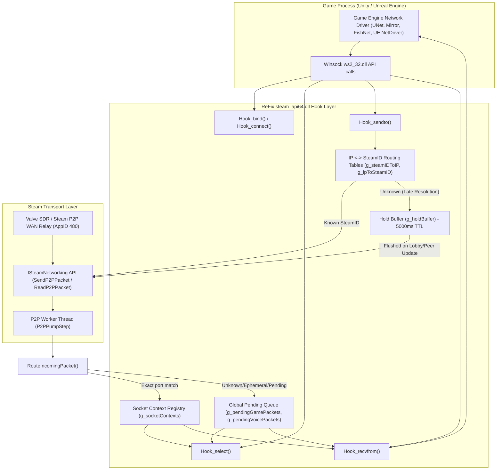
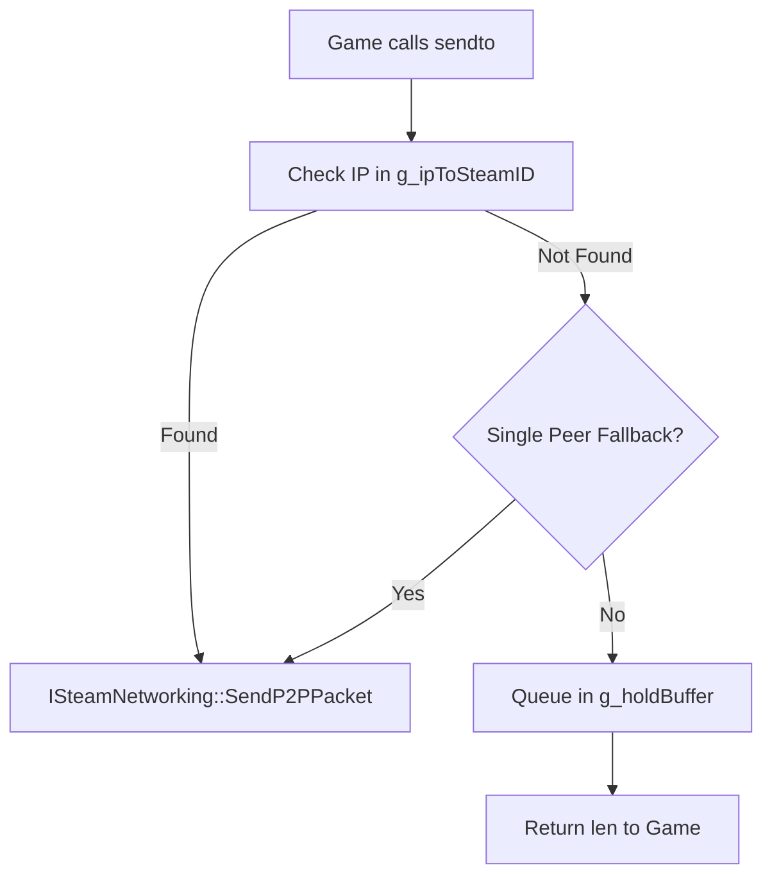
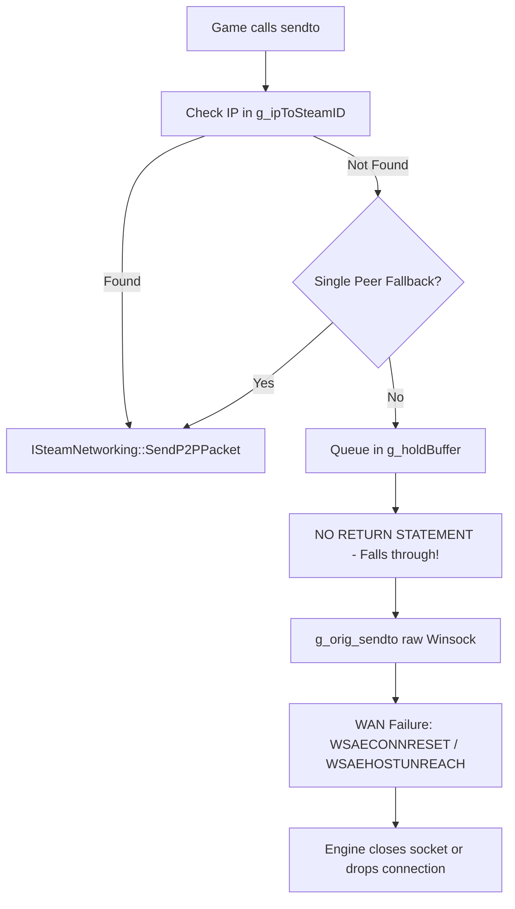
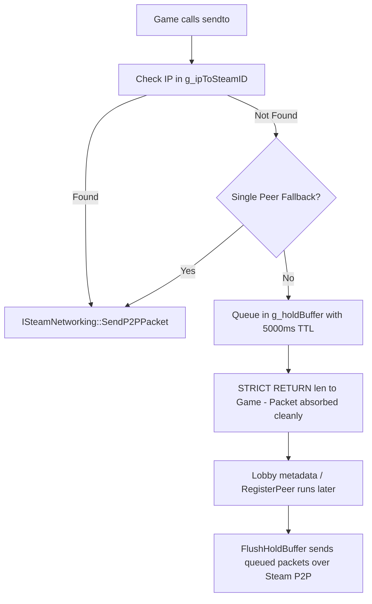
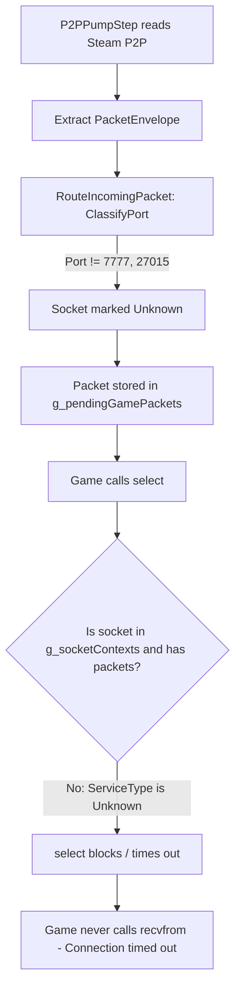
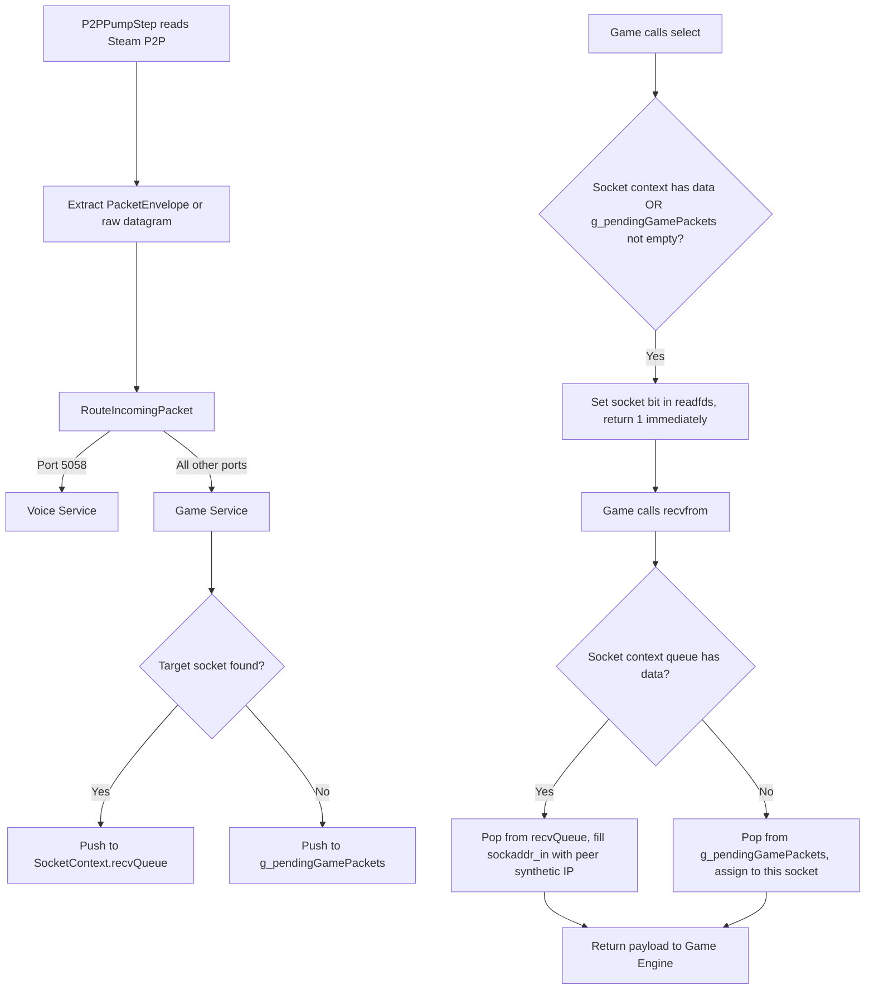
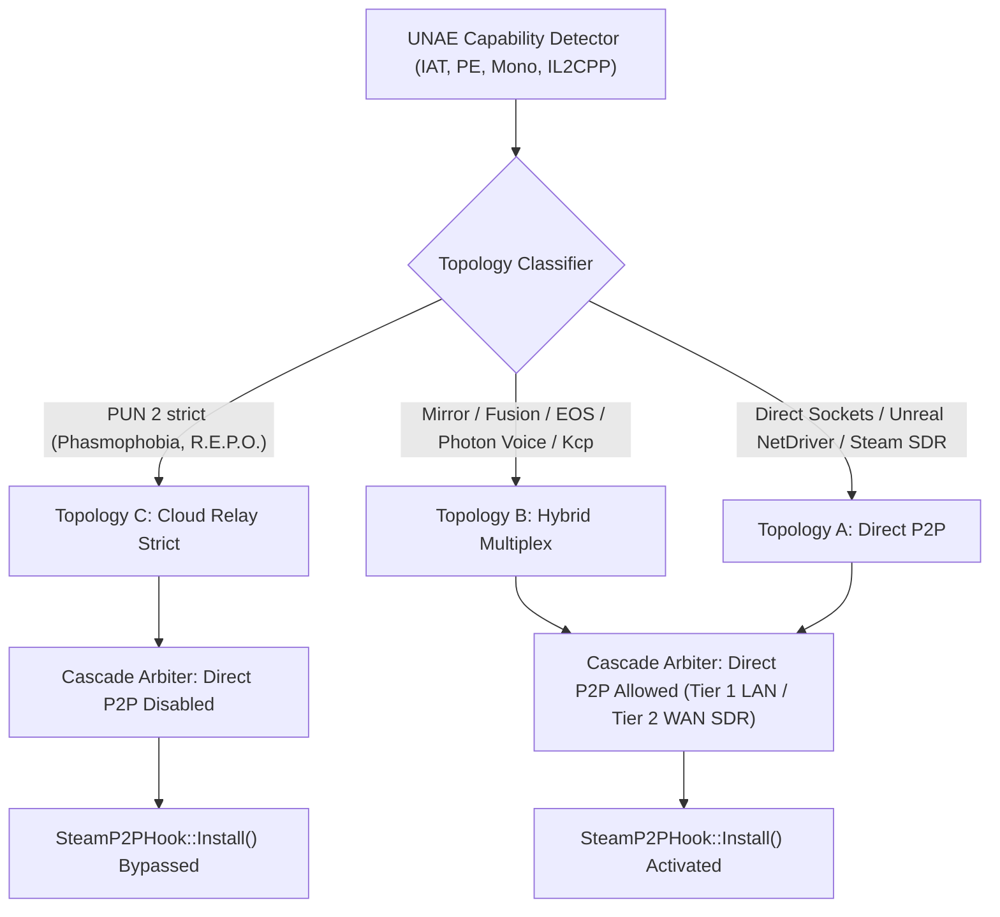

# ReFix Network Architecture: Winsock Hooking & Steam P2P Transport

**Document Version:** 1.0.0  
**Target Release:** ReFix v1.3.2  
**Baseline Compared:** v1.23 (`2341927`) vs v1.3.1 (`577f1bc`) vs v1.3.2 (`fix/wan-regression-v1.3.1`)  
**Scope:** Unity & Unreal Engine WAN/LAN Multiplayer over Steam P2P (`ISteamNetworking`) & Winsock Detours.

---

## 1. Executive Summary & Architectural Evolution

ReFix acts as a zero-overhead compatibility proxy for Steamworks (`steam_api64.dll`) and Winsock (`ws2_32.dll`), intercepting standard game socket operations (`sendto`, `recvfrom`, `select`, `bind`, `connect`, `closesocket`) and transparently tunneling UDP datagrams through Valve's encrypted P2P relay network (`ISteamNetworking::SendP2PPacket` / `ReadP2PPacket`).

| Architecture Dimension | v1.23 (`2341927`) | v1.3.1 (`577f1bc` - Broken) | v1.3.2 (`fix/wan-regression-v1.3.1` - Restored & Hardened) |
| :--- | :--- | :--- | :--- |
| **Winsock Interception** | Global FIFO queue for all incoming P2P packets | Per-socket contexts (`SocketContext`) with isolated RX queues | Per-socket context routing with permissive global pending fallback (`g_pendingGamePackets`) |
| **Unknown Peer TX** | Hold buffer queued; returned `len` to caller | Hold buffer queued; **fell through to raw Winsock `g_orig_sendto`** | Hold buffer queued; **strictly returns `len`**, avoiding raw Winsock leak & socket death |
| **`select()` Wakeup** | Signaled if global queue non-empty | Signaled only if exact socket had packets; ignored sockets with `serviceType == Unknown` | **Signals readable for any active socket** if `g_pendingGamePackets` has datagrams |
| **Ephemeral `bind(0)` Sockets** | Tracked socket descriptor; returned 0 | Recorded `requestedPort = 0`; failed matching incoming packets | Calls `getsockname()` to record actual OS port; drains pending packets |
| **Port Classification** | Hardcoded standard port list (7777, 27015, etc.) | Strict port filter; non-standard ports marked `ServiceType::Unknown` | **Port 5058 = Voice, all other UDP ports = Game traffic** |
| **Synthetic IP Space** | Mixed `10.x.x.x` and `127.x.x.x` | Inconsistent: `P2PPumpStep` used `127.0.0.x`, `steam_proxy` used `10.x.x.x` | **Unified `10.0.0.0/8`**: `0x0A000001 \| (SteamID & 0x00FFFFFF)`. Old IPs preserved as aliases |
| **UNAE Direct P2P Gate** | Disabled by default in early builds | Blocked if `hasPhotonVoice` placed game in `TopologyC_CloudRelayStrict` | `hasPhotonVoice` placed in `TopologyB_HybridMultiplex`; **Direct P2P allowed** |
| **Deploy Helper / Cecil** | Unconditional patch | Patch restricted to Goldberg, but switching back left ghost `.orig` files | Restores pristine `.orig` assemblies automatically in Valve mode |

---

## 2. High-Level System Architecture

---

## 3. Packet Flow Diagrams: TX (Transmission)

### 3.1 v1.23 Transmission Flow

### 3.2 v1.3.1 Transmission Flow (The Leak Regression)

### 3.3 v1.3.2 Restored Transmission Flow

---

## 4. Packet Flow Diagrams: RX (Reception) & Sockets

### 4.1 v1.3.1 Reception Deadlock Flow

### 4.2 v1.3.2 Restored Reception Flow

---

## 5. Queue Management & Synthetic IP Address Space

### 5.1 Synthetic IP Address Scheme (`10.0.0.0/8`)
To allow standard IPv4 Winsock networking to transparently communicate with 64-bit SteamIDs, ReFix assigns a deterministic, private Class A IPv4 address to each remote peer:
$$\text{Synthetic IPv4} = \text{0x0A000001} \mid (\text{SteamID} \ \& \ \text{0x00FFFFFF})$$
- Formatted as `10.x.y.z`.
- Fully routable inside the game process memory space.
- Does not collide with localhost (`127.0.0.1`) or local LAN subnets (`192.168.x.x`).

### 5.2 Alias Preservation in Routing Tables
When a lobby host advertises an external public or LAN IP (`serverIP`), ReFix maps the advertised IP to the host's `SteamID`. In v1.3.1, updating this mapping would erase any previously generated synthetic IP, causing pending transmissions to fail with `0.0.0.0`.
In v1.3.2:
- `RegisterPeer(steamID, newIP, port)` keeps the old synthetic IP in `g_ipToSteamID` as an alias.
- Outgoing packets to either the synthetic IP or the announced IP route to the identical `SteamID`.
- Remote non-host clients always retain unique synthetic IPs, preventing IP collision when multiple clients join behind different NATs.

### 5.3 Queue Isolation and Invariant Rules
1. **Hold Buffer Invariant:** Any datagram sent to an unresolved peer is held in `g_holdBuffer` for up to 5000ms. It must **never** be passed to `g_orig_sendto`.
2. **Select Non-Starvation Invariant:** Any non-voice socket must be woken up by `Hook_select()` if `g_pendingGamePackets` contains unread game datagrams.
3. **Ephemeral Binding Invariant:** If a socket binds to port 0 (`bind(0)`), `Hook_bind()` immediately retrieves the dynamically assigned OS port via `getsockname()` and registers it in `g_socketContexts`.
4. **Voice Isolation Invariant:** Port 5058 (`ReFix Dazzle Voice`) packets are segregated into `g_pendingVoicePackets` and delivered exclusively to sockets registered with `ServiceType::Voice`. Game sockets never receive voice frames.

---

## 6. UNAE & Deployment Topology Integration

### 6.1 Mono.Cecil Assembly Handling in Deploy Helper
- When deploying in **Goldberg Mode** (`$OnlineMode -eq "goldberg"`), `deploy_helper.ps1` patches `SteamInternal_SteamAPI_Init` to `SteamAPI_Init` so that emulators without internal exports can boot.
- When deploying in **Valve Mode** (`$OnlineMode -eq "valve"`), `deploy_helper.ps1` checks for `.orig` backup assemblies in `*_Data/Managed/` and automatically restores them. This guarantees pristine Valve exports for WAN Spacewar (AppID 480) sessions.

---

## 7. Verification Matrix

| Test Case | Scenario Tested | Pre-Fix Status | Post-Fix Status |
| :--- | :--- | :--- | :--- |
| `test_known_peer_send` | Outgoing sendto to mapped IP | PASSED | **PASSED** |
| `test_unknown_peer_send` | Outgoing sendto to unmapped IP | **FAILED** (leaked to raw Winsock) | **PASSED** (held in buffer, 0 leaks) |
| `test_late_peer_resolution` | Peer resolution after initial packets | **FAILED** (packets lost) | **PASSED** (flushed on RegisterPeer) |
| `test_single_peer_fallback` | Single remote peer connected | PASSED | **PASSED** |
| `test_multiple_peer_no_ambiguous_route` | Multiple peers, unmapped IP | PASSED | **PASSED** |
| `test_incoming_exact_socket_route` | Incoming P2P to explicit port | PASSED | **PASSED** |
| `test_incoming_ephemeral_socket` | Client socket bound to port 0 | **FAILED** (`select()` timeout) | **PASSED** (`select()` wakes up) |
| `test_nonstandard_game_port` | Arbitrary game port 9999 | **FAILED** (`select()` timeout) | **PASSED** (`select()` wakes up) |
| `test_game_and_voice_isolation` | Port 5058 Voice vs Game | PASSED | **PASSED** |
| `test_legacy_unframed_packet` | Raw datagram without envelope | PASSED | **PASSED** |
| `test_hold_buffer_flush` | Manual hold buffer flush | PASSED | **PASSED** |
| `test_hold_buffer_expiry` | Hold buffer 5000ms TTL expiry | PASSED | **PASSED** |
| `test_socket_close_cleanup` | `closesocket()` removes context | PASSED | **PASSED** |
