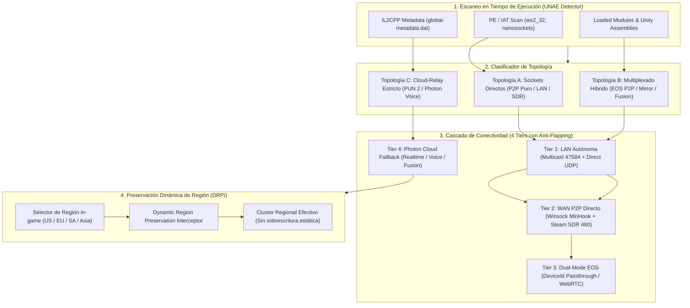

# Plan Maestro de Implementación: Motor de Arbitraje Universal de Red (UNAE) para ReFix

**Versión:** 3.0  
**Fecha:** 28 de Septiembre de 2026  
**Metodología:** Auditoría Adversarial Concurrente (Red Team vs Blue Team)  
**Alcance:** Middleware ReFix (`D:\EOS_REFIX\ReFix-git` y `D:\EOS_REFIX\ReFix_Release_v2.0-pre`)  
**Niveles de Prueba:**  
1. *Nivel 1 (Validado):* **Big Walk** (Mirror Multiplex, EOS WebRTC / KcpTransport).  
2. *Nivel 2 (En curso):* **Dumb Ways to Build** (Photon Fusion + `nanosockets.dll` + Steam SDR P2P).  
3. *Nivel 3 (Objetivo):* **Phasmophobia / R.E.P.O.** (Photon PUN 2 + Photon Voice + Selector de Región Dinámico in-game).

---

## 1. Visión y Arquitectura General del Sistema

El **Motor de Arbitraje Universal de Red (Universal Network Arbitration Engine - UNAE)** es el núcleo de decisión y enrutamiento autónomo de ReFix. Su objetivo fundamental es resolver de manera determinista, transparente y tolerante a fallos el dilema de transporte en juegos multijugador emulados: **cuándo utilizar P2P directo (LAN / Steam SDR) y cuándo recurrir a infraestructura de relevo gestionada o nubes de terceros (Epic Online Services / Photon Cloud)**.



---

## 2. Informe Forense Adversarial (Red Team)

La auditoría forense del Red Team identificó **7 vectores de ruptura críticos** que deben mitigarse obligatoriamente en el diseño arquitectónico:

| ID | Vector de Ruptura | Severidad | Causa Raíz Técnica | Mitigación Blue Team |
| :---: | :--- | :---: | :--- | :--- |
| **V-01** | **Envenenamiento y secuestro de `g_lastGameSocket`** | **FATAL** | En `steam_p2p_hook.cpp`, existe un único atomic global `g_lastGameSocket`. En juegos con voz (puertos 5055 y 5058), el socket de voz sobrescribe al de juego, haciendo que `Hook_recvfrom` deje de drenar paquetes de juego y entregue datos de partida al decodificador Opus. | **NFR-01:** Tabla hash concurrente `unordered_map<SOCKET, SocketContext>` con colas de paquetes independientes por puerto/servicio. |
| **V-02** | **Fuga de paquetes por desincronización pre-lobby** | **ALTA** | Condición de carrera: Fusion arranca en `T+80ms` y envía datagramas de handshake antes de que el callback de Steam registre los peers (`T+1200ms`). `Hook_sendto` cae en fallthrough a Winsock crudo y los paquetes se pierden. | **NFR-02:** *Pre-Lobby Hold Buffer* con expiración TTL (3000 ms) que retiene datagramas hasta que el lobby confirme la topología. |
| **V-03** | **Falla de ICE WebRTC bajo NAT Simétrico o DPI** | **CRÍTICA** | En Big Walk con NAT simétrico o bloqueo corporativo de UDP, WebRTC no perfora puertos y los servidores TURN de Epic deniegan relevo a credenciales no propietarias. Mirror no hace fallback automático a KCP. | **NFR-03:** Sonda activa de conectividad ICE con timeout rápido (3500 ms) y conmutación forzada a túnel SDR de Steam. |
| **V-04** | **Colisión de puerto local (`WSAEADDRINUSE`)** | **ALTA** | Dos instancias del juego en la misma máquina física colisionan al intentar ligar el puerto predeterminado UDP 27015 o 7777. | **NFR-04:** Port Virtualization en `Hook_bind`: ante `10048`, reintenta en puerto efímero dinámico y lo mapea en el lobby. |
| **V-05** | **Imposibilidad de PUN 2 como P2P directo** | **FATAL** | PUN 2 exige asignación atómica de `ActorNumber`, sincronización de `Room Event Cache` y ventanas ACK centralizadas. Un P2P crudo sin árbitro causa desincronización total del estado. | **NFR-05:** Reconocer formalmente que PUN 2 requiere servidor relay (vía Photon Cloud con AppID desacoplado o micro-relay Re:Photon local). |
| **V-06** | **Desincronización por forzado estático de región** | **ALTA** | Si `ReFix.ini` o `Kirigiri.ini` fuerzan `FixedRegion = eu`, cuando el jugador elige "Asia" en la UI de *Phasmophobia* o *R.E.P.O.*, el servidor rechaza el token regional (`InvalidRegionToken 230`) o genera salas fantasma. | **NFR-06:** Implementar el módulo **DRPI** que intercepta `ConnectToRegionMaster` y respeta la elección en runtime del usuario. |
| **V-07** | **Agotamiento asimétrico de cuotas (CCU Throttling)** | **MEDIA** | Reutilizar la misma clave de Photon para juego y audio satura los 20 CCU gratuitos de voz y congela el hilo de audio de Unity. | **NFR-07:** Desacoplamiento estricto en configuración: `AppIdRealtime`, `AppIdVoice` y `AppIdFusion` independientes. |

---

## 3. Especificación Técnica de la Arquitectura (Blue Team)

### 3.1. Matriz de Detección de Capacidades en Tiempo de Ejecución

UNAE ejecuta un escaneo multi-etapa en `DllMain` / `SteamAPI_Init`:
1. **Fase 1 (IAT & PE Headers):** Detecta `ws2_32.dll`, `nanosockets.dll`, `steam_api64.dll`, `EOSSDK-Win64-Shipping.dll`.
2. **Fase 2 (Loaded Modules):** Hashes FNV-1a sobre módulos cargados para evitar hooks lentos.
3. **Fase 3 (Unity Managed Assemblies):** Búsqueda de `Photon3Unity3D.dll`, `PhotonRealtime.dll`, `PhotonVoice.dll`, `Fusion.Runtime.dll`, `Mirror.dll`, `kcp2k.dll`.
4. **Fase 4 (IL2CPP Metadata):** En juegos IL2CPP sin DLLs administradas, escanea cadenas clave en `global-metadata.dat` sin inicializar el runtime.

### 3.2. Cascada de Conectividad en 4 Tiers con Anti-Flapping

```
[ Tier 1: LAN Autónoma ]
   │  * Multicast UDP 239.255.71.84:47584 + Direct Sockets
   │  * Cero Internet, cero cuentas, cero validaciones
   ▼ (Si no hay hosts locales tras 2500ms y OnlineMode == valve)
[ Tier 2: WAN P2P Directo ]
   │  * Winsock Hooks (MinHook) + Valve Steam SDR (AppID 480)
   │  * Multi-socket context table (separación estricta Game vs Voice)
   ▼ (Si P2P falla > 5000ms o Packet Loss > 40% o juego requiere EOS)
[ Tier 3: Dual-Mode EOS ]
   │  * DeviceIdAuth Passthrough (Epic WebRTC P2P) o Emulated RedboneEOS
   ▼ (Si el juego es Topología C estricta)
[ Tier 4: Photon Cloud Fallback ]
      * Desacoplamiento granular: AppIdRealtime, AppIdVoice, AppIdFusion
      * Módulo DRPI activo para preservación de región in-game
```

**Reglas de Anti-Flapping (Hysteresis):**
* **Locking Window:** 15 segundos de estabilidad obligatoria antes de permitir re-evaluación de ruta.
* **Failure Threshold:** 5 fallos consecutivos de heartbeat (1000 ms c/u) para degradar de Tier.
* **Recovery Cooldown:** 60 segundos antes de intentar ascender a un Tier inferior.

### 3.3. Preservación Dinámica de Región (DRPI)

Para juegos con selector de región en la interfaz (*Phasmophobia*, *R.E.P.O.*):
1. **Interceptación de Intención:** Hook sobre `Photon.Realtime.LoadBalancingClient::ConnectToRegionMaster(string region)` y el parámetro `0xD2` en `OpAuthenticate`.
2. **Runtime Region Cache:** Almacena la región elegida por el jugador en `g_userSelectedRegion` en memoria sin sobreescribir archivos INI en disco.
3. **Enrutamiento por Backend:**
   * Si `Backend = OfficialPhoton` o `CustomPhoton`: Permite que la cadena regional seleccionada viaje intacta al NameServer oficial (`ns.photonengine.io`).
   * Si `Backend = ReFixCloud`: Mapea dinámicamente la región seleccionada al cluster correspondiente (`sa.refixcloud.net`, `us.refixcloud.net`, `eu.refixcloud.net`).
4. **Echo Probe Hook:** Simula los pings de `RegionHandler::PingMinimumOfRegions` mediante sondeos UDP reales, manteniendo los indicadores de ping in-game funcionales y precisos.

---

## 4. Matriz de Comportamiento en los 3 Niveles de Prueba

| Nivel / Juego | Arquitectura Detectada | Topología | Transporte Seleccionado | Manejo de Voz | Fallback de Región |
| :--- | :--- | :---: | :--- | :--- | :--- |
| **Nivel 1: Big Walk** *(Logrado)* | PlayEveryWare EOS + Mirror Multiplex | **Topología B** | WAN: Epic WebRTC P2P vía `DeviceIdAuth` (Passthrough).<br>LAN: Mirror KcpTransport (UDP 7777). | Integrado en EOS WebRTC | N/A (Mundial / Epic Presence) |
| **Nivel 2: Dumb Ways to Build** | Photon Fusion + `nanosockets.dll` | **Topología B** | WAN: Sockets UDP tunelizados por **Steam SDR P2P** (AppID 480).<br>LAN: `nanosockets.dll` directo en UDP 27015. | Canales Opus separados en `SocketContext` | Si usa Cloud: parche automático en `level0` offset 16052 |
| **Nivel 3: Phasmophobia / R.E.P.O.** | Photon PUN 2 + Photon Voice | **Topología C** | **Tier 4 Cloud Relay** (ReFixCloud o Custom AppID).<br>*P2P directo deshabilitado para evitar desincronización de Actor IDs*. | `AppIdVoice` independiente en puerto 5058 | **DRPI Activo:** Respeta 100% el desplegable del menú (US/EU/Asia) |

---

## 5. Especificación Unificada del Archivo `ReFix.ini`

```ini
; =============================================================================
; ReFix Universal Network Arbitration Engine (UNAE) Configuration
; =============================================================================

[Network]
; Modo global de arbitraje:
;   auto         - Detección automática de capacidades, topología y cascada inteligente (Recomendado).
;   force_p2p    - Fuerza transporte P2P directo (Tier 1 LAN / Tier 2 SDR). Falla si el juego requiere cloud relay.
;   force_relay  - Salta P2P directo y enruta inmediatamente a través de nubes de relevo (EOS / Photon).
;   force_lan    - Aísla la conectividad a la subred local (Tier 1 exclusivo, sin salidas a Internet).
;   offline      - Desactiva toda actividad de red externa; emulación local absoluta.
Mode = auto

; Puerto base de escucha y descubrimiento UDP para Re:Goldberg y UNAE LAN (Default: 47584)
DiscoveryPort = 47584

; Grupo de multidifusión IPv4 para descubrimiento sin configuración en la misma subred
DiscoveryGroup = 239.255.71.84

; Tiempo de espera de respuesta de hosts locales en LAN antes de evaluar WAN (milisegundos)
LanProbeTimeoutMs = 2500

; IPs de difusión adicionales para VPNs (Radmin, Hamachi, ZeroTier) separadas por comas
CustomBroadcasts = 

; Registro detallado del motor de arbitraje en ReFix.log
VerboseArbitrationLog = true


; =============================================================================
; Direct P2P & Valve Steam Datagram Relay (SDR) Tunneling
; =============================================================================
[P2P]
; Habilita los hooks de intercepción sobre ws2_32.dll (sendto, recvfrom, connect, select)
EnableWinsockHooks = true

; Enruta paquetes UDP de juegos a través del túnel ISteamNetworking SDR de Valve (AppID 480)
EnableSteamSDR = true

; Permite la retransmisión por servidores mundiales de Valve si no hay conexión P2P directa
AllowRelay = true

; Puerto UDP principal de la sesión de juego (Default: 7777 para Unreal/Mirror, 27015 para Fusion)
P2PPort = 7777

; Tiempo de espera de negociación de sesión P2P antes de activar fallback (milisegundos)
PeerHandshakeTimeoutMs = 5000

; Máximo porcentaje de pérdida de paquetes tolerable antes de transicionar de Tier (Default: 40)
MaxPacketLossTolerance = 40


; =============================================================================
; Photon Ecosystem & Cloud Relay Configuration (PUN 2, Realtime & Fusion)
; =============================================================================
[Photon]
; Proveedor de backend para el ecosistema Photon:
;   ReFixCloud      - Infraestructura gestionada/local ReFix (Cero costo, alto rendimiento).
;   OfficialPhoton  - Conexión a la nube pública de Photon Engine (Requiere AppIDs válidos).
;   CustomPhoton    - Servidores privados self-hosted (Photon Server / Luxon).
Backend = OfficialPhoton

; Clave de Aplicación desacoplada para Photon Realtime y PUN 2 (Sincronización de juego y salas)
AppIdRealtime = 

; Clave de Aplicación desacoplada para Photon Fusion (Tick simulation / Predicción de estado)
AppIdFusion = 

; Gestión de Regiones:
;   dynamic - Preserva fielmente la región seleccionada por el usuario en la UI del juego (Recomendado).
;   auto    - Realiza sondeo de ping y conecta automáticamente a la región de menor latencia.
;   fixed   - Fuerza estáticamente la región definida en DefaultRegion, bloqueando la UI del juego.
RegionMode = dynamic

; Región por defecto o de contingencia (sa, us, usw, use, eu, asia, jp, ru)
DefaultRegion = sa

; Preserva la selección de región del jugador en interfaces como Phasmophobia y R.E.P.O.
PreserveGameUiRegion = true


; =============================================================================
; Positional Audio & Voice Communications Subsystem
; =============================================================================
[Voice]
; Backend de transmisión de voz:
;   PhotonVoice - Utiliza el canal desacoplado Photon Voice 2 (Opus 24-48kHz).
;   EOSRTC      - Utiliza las salas de voz WebRTC de Epic Online Services.
;   SteamVoice  - Utiliza la API ISteamUser::GetVoice de Steamworks.
;   Disabled    - Desactiva el subsistema de comunicaciones por voz.
Backend = PhotonVoice

; Clave de Aplicación desacoplada exclusiva para Photon Voice 2
; NOTA CRÍTICA: No reutilizar la misma clave de AppIdRealtime para evitar agotar el límite de CCU.
AppIdVoice = 

; Tasa de muestreo de audio / Bitrate de voz (en bps, Default: 32000)
Bitrate = 32000

; Activa la intercepción de atenuación espacial 3D según la distancia entre avatares
EnableProximityVoice = true
```

---

## 6. Plan de Acción y Fases de Ejecución

### Fase 1: Hardening de Sockets y Mitigación de Vulnerabilidades Red Team
1. **Refactorización de `steam_p2p_hook.cpp`:**
   - Eliminar `g_lastGameSocket` atómico único.
   - Implementar `std::unordered_map<SOCKET, SocketContext>` con colas independientes para paquetes de juego (puertos 7777 / 27015 / 5055) y paquetes de voz (puerto 5058).
   - Implementar el *Pre-Lobby Hold Buffer* (retención de 3000 ms antes de fallthrough a Winsock crudo).
2. **Port Virtualization en `Hook_bind`:**
   - Capturar error `10048 (WSAEADDRINUSE)` y asignar puerto incremental (`27016`, `27017`...) notificándolo en el metadato del lobby de Steam.

### Fase 2: Implementación del Módulo UNAE (`src/unae/`)
1. Crear `src/unae/unae_types.h`, `src/unae/capability_detector.h`, `src/unae/capability_detector.cpp`.
2. Crear `src/unae/cascade_arbiter.h`, `src/unae/cascade_arbiter.cpp`.
3. Crear `src/unae/region_interceptor.h`, `src/unae/region_interceptor.cpp` (DRPI).
4. Conectar el punto de entrada de escaneo en `steam_proxy.cpp` y `eos_module.cpp`.

### Fase 3: Integración y Despliegue en `deploy_helper.ps1`
1. Actualizar `deploy_helper.ps1` para generar la nueva plantilla `ReFix.ini` con las 4 secciones unificadas.
2. Incorporar la lógica de detección de topologías en PowerShell para advertir al usuario en consola el modo óptimo seleccionado.
3. Automatizar el parche de `level0` para Photon Fusion cuando `AppIdFusion` esté configurado.

### Fase 4: Protocolo de Pruebas y Criterios de Aceptación
1. **Nivel 1 (Big Walk):**
   - Verificar generación de código de unión y tráfico P2P WebRTC bajo `[Network] Mode = auto`.
   - Verificar funcionamiento offline en LAN (UDP 7777).
2. **Nivel 2 (Dumb Ways to Build):**
   - Verificar que al crear lobby en Steam, el Pre-Lobby buffer previene timeouts en `nanosockets.dll`.
   - Verificar que dos instancias en la misma PC no crashean por `WSAEADDRINUSE`.
   - Verificar que con AppID en `level0` o vía túnel P2P se elimina el error `AUT-004`.
3. **Nivel 3 (Phasmophobia / R.E.P.O.):**
   - Verificar que UNAE clasifica el juego como **Topología C** y no fuerza Winsock P2P crudo.
   - En el menú principal, conmutar entre `US`, `EU` y `SA`: verificar en `ReFix.log` que el módulo **DRPI** captura la región dinámicamente y conecta al cluster correcto sin lanzar `InvalidRegionToken`.
   - Hablar por micrófono y verificar que el canal de voz corre en `AppIdVoice` sin interrumpir la sincronización del fantasma/jugadores.

---

## 7. Instrucciones para Ejecución en Nuevo Chat

Para retomar y ejecutar la implementación técnica de este plan en un chat nuevo, utiliza el siguiente prompt:

```text
Por favor retoma la implementación técnica del Plan Maestro de Arbitraje Universal de Red (UNAE) para ReFix.
El documento maestro de especificación y arquitectura se encuentra guardado localmente en:
1. Artifact: plan_maestro_arbitraje_red_p2p_photon.md
2. Repositorio: D:\EOS_REFIX\ReFix-git\docs\PLAN_MAESTRO_ARBITRAJE_RED_UNAE.md

Por favor comienza directamente con la Fase 1:
1. Hardening de steam_p2p_hook.cpp para solucionar la vulnerabilidad V-01 (tabla multi-socket concurrente para separar Game y Voice) y V-02 (Pre-Lobby Hold Buffer).
2. Compilación de prueba con build.bat y verificación de los binarios resultantes.
```
