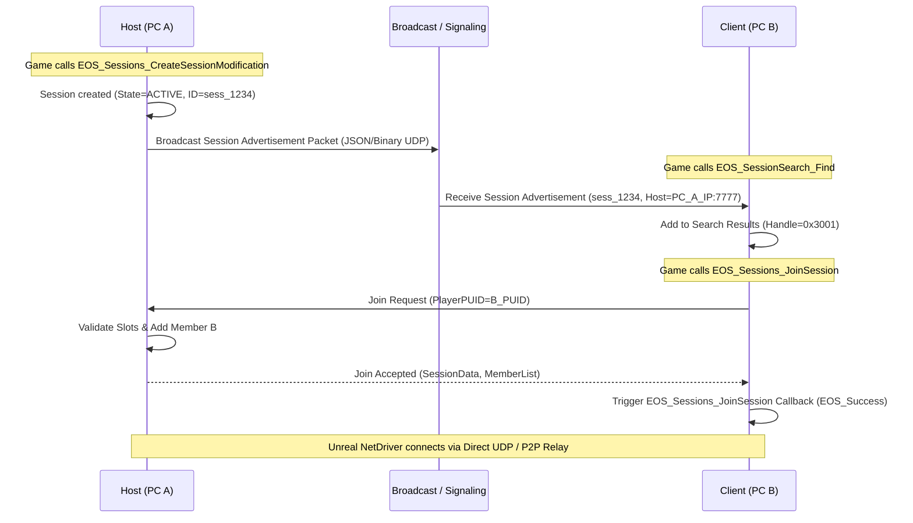

# ReFix EOS Online v2 — System Architecture Specification

## 1. Overview & Architectural Goals

The goal of **ReFix EOS Online v2** is to replace the ad-hoc Steam-wrapper proxy in `src/eos_proxy.cpp` with a clean, modular, and authoritative Epic Online Services (EOS) emulation architecture. 

The architecture strictly decouples:
1. **Frontend EOS Compatibility Layer**: Binary-compatible C ABI implementation of the EOS SDK interfaces (`EOS_Platform_*`, `EOS_Auth_*`, `EOS_Connect_*`, `EOS_Lobby_*`, `EOS_Sessions_*`, `EOS_P2P_*`, `EOS_Presence_*`, `EOS_Friends_*`, `EOS_UserInfo_*`).
2. **ReFix Online Core (State Engine)**: In-memory authoritative state machines for user identity, sessions, lobbies, member registries, attributes, notifications, and callbacks.
3. **ReFix Online Wire Transport & Backend**: Distributed peer discovery (LAN broadcast), direct P2P transport (UDP/STUN/UPnP), centralized/distributed matchmaking signaling, and fallback relay server support.

```mermaid
graph TD
    subgraph "Unreal Engine Process (Game.exe)"
        UE[Unreal Engine Runtime] --> OSS[OnlineSubsystemRedpoint / RedpointEOS]
        OSS -->|EOS SDK C-ABI Calls| PROXY[EOSSDK-Win64-Shipping.dll / RedboneEOS.dll]
        
        subgraph "ReFix EOS Online v2 Frontend"
            PROXY --> PLAT[Platform & Tick Dispatcher]
            PROXY --> AUTH[Auth & Connect Interface]
            PROXY --> LOBBY[Lobby Interface]
            PROXY --> SESS[Sessions Interface]
            PROXY --> P2PI[P2P Interface]
            PROXY --> PRES[Presence & Friends Interface]
        end

        subgraph "ReFix Online Core (Local State)"
            PLAT --> CBQ[Async Callback & Notification Queue]
            AUTH --> IDM[Deterministic Identity Manager]
            LOBBY --> LSM[Authoritative Lobby State Machine]
            SESS --> SSM[Authoritative Session State Machine]
            PRES --> PRM[Presence Registry]
        end

        subgraph "ReFix Transport & Networking Layer"
            LSM <--> NET[Network State Synchronizer]
            SSM <--> NET
            P2PI <--> P2PM[P2P Connection Manager]
            NET <--> LAN[LAN UDP Broadcast Discovery (Port 47584)]
            NET <--> WAN[ReFix Online WAN Signaling / Matchmaking]
            P2PM <--> DIRECT[Direct UDP P2P / UPnP Hole Punching]
            P2PM <--> RELAY[ReFix Relay Fallback Service]
        end
    end

    subgraph "Remote Peer (PC B) / Online Network"
        LAN <--->|LAN UDP Broadcast| PEER_LAN[Peer PC B on Local Network]
        WAN <--->|WAN State Sync| BACKEND[ReFix Online Matchmaker / Signaling]
        DIRECT <--->|Direct UDP Packets| PEER_WAN[Peer PC B Direct UDP]
        RELAY <--->|Encrypted Relay Packets| RELAY_SRV[ReFix Relay Server]
        RELAY_SRV <---> PEER_WAN
    end
```

---

## 2. Layer 1: Frontend EOS ABI Compatibility Layer (`src/eos/`)

The Frontend Layer directly intercepts exports from `EOSSDK-Win64-Shipping.dll` (or `RedboneEOS.dll`). It enforces strict ABI version compliance and memory layout safety across all EOS SDK versions (1.0 through 1.16+).

### Key Responsibilities:
- **Struct Version Validation**: Read `ApiVersion` header from every EOS options struct and route to version-specific unpackers.
- **Opaque Handle Safety**: Allocate distinct, typed heap handles (`EOS_HLobbyDetails`, `EOS_HLobbyModification`, `EOS_HSessionDetails`, `EOS_HSessionModification`, `EOS_HSessionSearch`, `EOS_HLobbySearch`, `EOS_HActiveSession`) containing magic signatures and ref-counts, eliminating raw pointer heuristics.
- **Memory Release Tracking**: Provide thread-safe `_Release` handlers (`EOS_LobbyDetails_Release`, `EOS_SessionDetails_Release`, `EOS_Lobby_Attribute_Release`, etc.) to prevent memory leaks and dangling pointer crashes.
- **Callback Marshalling**: Never execute application callbacks synchronously within SDK entry points. All async completions are queued into the local Platform Tick queue and dispatched during `EOS_Platform_Tick()`.

---

## 3. Layer 2: ReFix Online Core (`src/eos_core/`)

The Core layer contains authoritative, decoupled state machines that mirror official EOS behavior without relying on Steamworks.

### 3.1. Identity Engine (`IdentityManager`)
- Generates unique, persistent, and collision-resistant **ProductUserIds** and **EpicAccountIds**.
- Formula:
  $$\text{PUID} = \text{Hex}(\text{SHA256}(\text{HardwareGUID} \parallel \text{MachineName} \parallel \text{ReFixSalt}))[0\dots31]$$
- Provides bi-directional mapping between local SteamID64 (when running under Steam proxy), PersonaName, and EOS PUIDs.
- Supports multi-user contexts (local player + discovered remote peers).

### 3.2. Authoritative Lobby State Machine (`LobbyStateManager`)
Maintains full lifecycle state:
$$\text{NONE} \xrightarrow{\text{CreateLobby}} \text{CREATING} \xrightarrow{\text{Success}} \text{ACTIVE} \xrightarrow{\text{Update/Join/Leave}} \text{ACTIVE} \xrightarrow{\text{Destroy}} \text{DESTROYED}$$

- **Lobby Schema**:
  - `LobbyId`: 64-bit random alphanumeric string (e.g., `eos_lob_9f83a21bc4d7e801`).
  - `OwnerPUID`: The authoritative owner ProductUserId.
  - `PermissionLevel`: `EOS_LPL_PUBLICADVERTISED`, `EOS_LPL_JOINVIAPRESENCE`, `EOS_LPL_INVITEONLY`.
  - `MaxMembers` & `AvailableSlots`: Dynamically updated as players join and leave.
  - `BucketId`: Custom game bucket (e.g. `GameMode:Map:Version`).
  - `Attributes`: Key-Value map supporting `STRING`, `INT64`, `DOUBLE`, `BOOLEAN` with advertisement flags (`EOS_LAT_PUBLIC`, `EOS_LAT_PRIVATE`).
  - `Members`: Ordered list of `ProductUserId` members with per-member attributes.

### 3.3. Authoritative Session State Machine (`SessionStateManager`)
- Specifically supports Unreal Engine's listen/dedicated server session workflow.
- **Session Schema**:
  - `SessionName`: Local name given by Unreal (e.g., `GameSession`, `PartySession`).
  - `SessionId`: Unique network-wide GUID.
  - `HostAddress`: IPv4/IPv6 + Port string (`IP:Port` format) or P2P PUID token.
  - `NumOpenPublicConnections` / `NumOpenPrivateConnections`: Dynamic capacity calculation.
  - `bAllowJoinInProgress`, `bInvitesAllowed`, `bUsesPresence`.
  - `SessionSettings`: Complete dynamic attribute dictionary.

### 3.4. Event & Notification Dispatcher (`NotificationManager`)
- Manages client subscription callbacks for:
  - `EOS_Lobby_AddNotifyLobbyMemberStatusReceived`
  - `EOS_Lobby_AddNotifyLobbyUpdateReceived`
  - `EOS_Lobby_AddNotifyLobbyInviteReceived`
  - `EOS_Sessions_AddNotifySessionInviteReceived`
  - `EOS_Sessions_AddNotifyJoinSessionAccepted`
  - `EOS_P2P_AddNotifyPeerConnectionRequest`
  - `EOS_P2P_AddNotifyPeerConnectionClosed`
- Dispatches event payloads to registered game callbacks whenever network state changes occur.

---

## 4. Layer 3: Networking, Wire Transport & Backend (`src/refix_online/`)



### 4.1. Dual Transport Architecture
1. **Local Area Network (LAN) Transport**:
   - UDP Broadcast on configurable port (`ListenPort = 47584`).
   - Periodic heartbeat announcements (interval: 1.5s).
   - Peer discovery with automatic IP address and port resolution.
2. **Wide Area Network (WAN) Online Backend**:
   - Lightweight standalone matchmaking and relay server (or distributed room signaling).
   - WebSocket / UDP signaling protocol for session registration, search query filtering, and invite routing.

### 4.2. P2P Transport Layer (`EOS_P2P_*`)
- Real socket multiplexing by `EOS_P2P_SocketId` and `Channel` (0-255).
- Send modes:
  - `EOS_PR_UnreliableUnordered` (raw UDP datagrams).
  - `EOS_PR_ReliableUnordered` (ACKed packet sequencing).
  - `EOS_PR_ReliableOrdered` (Sliding window ordered stream).
- **NAT Traversal Pipeline**:
  1. Direct UDP connection (local IP / port).
  2. STUN / UPnP port mapping.
  3. Seamless fallback to ReFix Relay Server if direct UDP fails.
