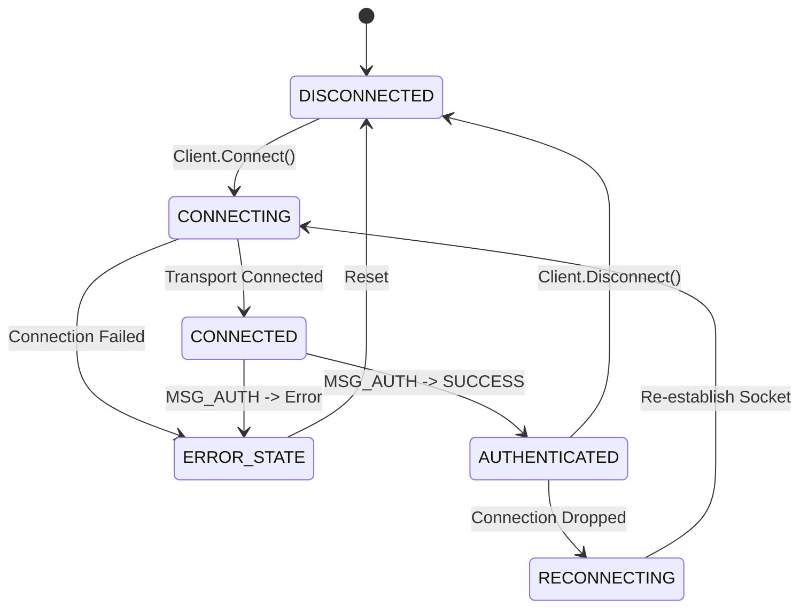
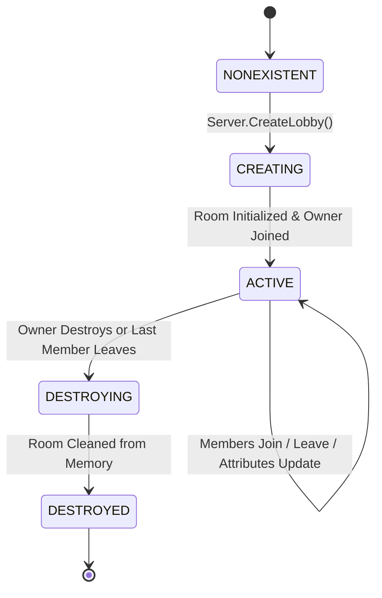

# ReFix Online v2 — Backend State Machine Specification

## 1. Client Connection State Machine

---

## 2. Lobby Lifecycle State Machine

---

## 3. Member Lifecycle & Ownership Transfer Policy

### 3.1. Member State Transitions
1. `NOT_MEMBER`: User is authenticated but not in the target lobby.
2. `JOINING`: User sends `MSG_JOIN_LOBBY`; server verifies capacity and uniqueness.
3. `MEMBER`: User is registered in lobby membership list and receives updates.
4. `LEAVING`: User sends `MSG_LEAVE_LOBBY` or encounters heartbeat timeout.
5. `LEFT`: User removed from lobby roster; notification broadcast to remaining members.

### 3.2. Ownership Migration Rules
- If the current lobby owner leaves or disconnects:
  1. The server inspects the remaining member list sorted by `joinTime` ascending.
  2. Ownership (`isOwner = true` and `lobby.ownerUserId`) is automatically transferred to the **oldest remaining member**.
  3. A `MSG_MEMBER_LEFT` notification is broadcast to all remaining members containing the `newOwnerUserId`.
  4. If zero members remain after the leave, the lobby transition enters `DESTROYED` and memory is immediately reclaimed.

---

## 4. Heartbeat & Resynchronization

1. **Heartbeat Loop**:
   - Clients send `MSG_HEARTBEAT` every 5 seconds.
   - The server updates `session.lastHeartbeat = GetCurrentTimeMs()`.
   - Every 5 seconds, the server sweeps for stale sessions (`currentTime - lastHeartbeat > 15,000ms`).
   - Timed-out users are automatically removed from active lobbies with owner transfer applied.
2. **Lobby Resynchronization (`MSG_RESYNC_LOBBY`)**:
   - Allows a reconnected client to immediately pull the authoritative lobby snapshot (members list, owner, attributes, capacity) to rebuild local UI/game state without creating duplicate rooms.
