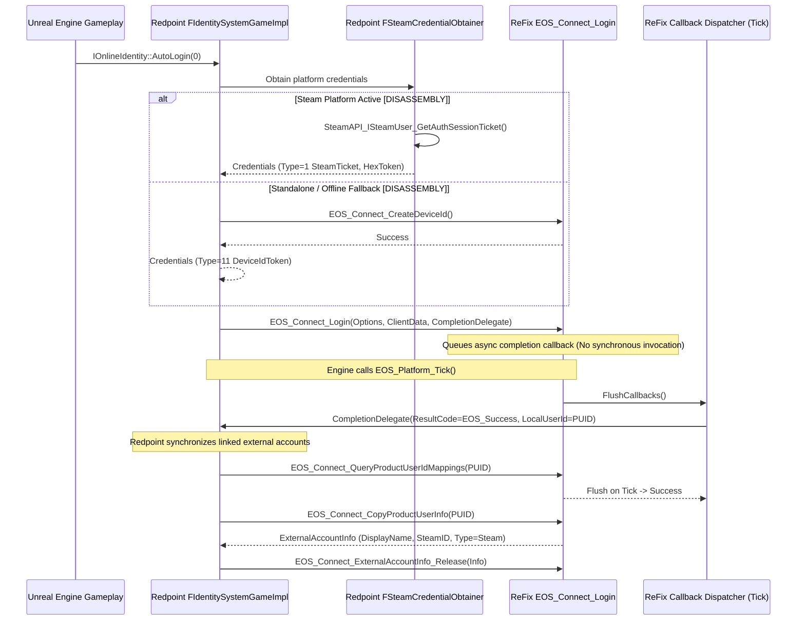
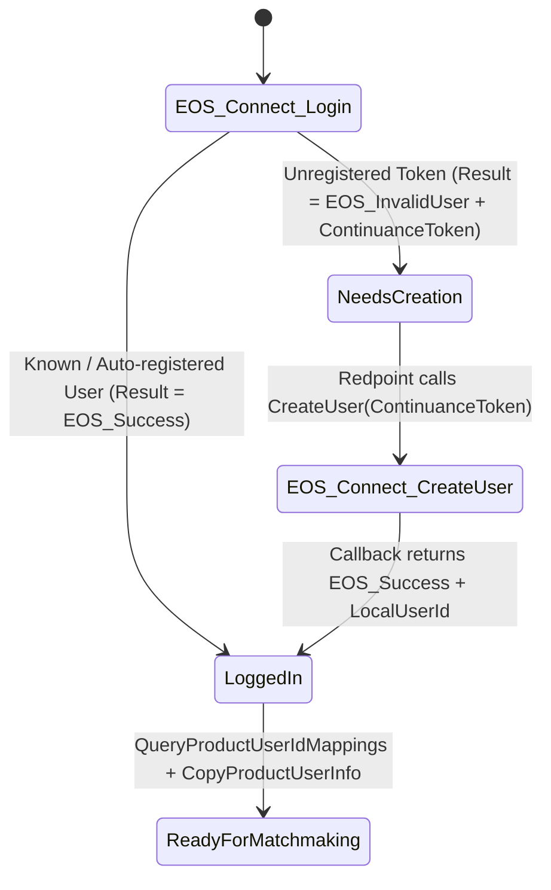

# RedpointEOS Connect & Authentication Contract Specification

## 1. Observed Authentication Call Graph `[DISASSEMBLY]` `[CONTROLLED TEST]`

Disassembly of *MECCHA CHAMELEON* (`PenguinHotel-Win64-Shipping.exe`) confirms the exact call sequence:



---

## 2. Credential Model `[DISASSEMBLY]` `[EPIC DOCS]`

RedpointEOS implements `FAuthenticationCredentialObtainer` with concrete platform providers:
1. **`EOS_ECT_STEAM_SESSION_TICKET` (Value `1`)** `[DISASSEMBLY]`:
   - Primary credential when game is launched via Steam or Goldberg emulator.
   - Token contains hex-encoded Steam auth session ticket.
2. **`EOS_ECT_DEVICEID_ACCESS_TOKEN` (Value `11`)** `[DISASSEMBLY]`:
   - Fallback credential when Steam is not initialized or in standalone test mode.
   - Initialized via `EOS_Connect_CreateDeviceId`.

---

## 3. Callback & Asynchronous State Model `[EPIC DOCS]` `[CONTROLLED TEST]`

- **Strict Asynchronous Guarantee**: `EOS_Connect_Login` never invokes `CompletionDelegate` within its own call stack. It pushes a payload to `CallbackManager` and returns immediately.
- **Tick Dispatch**: Execution occurs strictly when the game engine invokes `EOS_Platform_Tick()`.
- **Thread Safety**: Multiple background threads may query mappings or trigger auth updates concurrently; callback queueing is protected by mutex locks.

---

## 4. ContinuanceToken & User Creation State Machine `[EPIC DOCS]` `[CONTROLLED TEST]`



1. In ReFix Online v2, local users are automatically mapped to the persistent `AccountUUID`, allowing `EOS_Connect_Login` to succeed immediately with `EOS_Success`.
2. For compatibility with strict EOS SDK compliance, if `EOS_InvalidUser` is ever returned, the `ContinuanceToken` is an opaque heap handle (`magic = 0x43544F4B`) that resolves in `EOS_Connect_CreateUser`.

---

## 5. External Account Info Contract `[CONTROLLED TEST]`

Layout matching official EOS SDK `EOS_Connect_ExternalAccountInfo`:
```cpp
struct EOS_Connect_ExternalAccountInfo {
    int32_t ApiVersion;             // 1
    EOS_ProductUserId ProductUserId;// Local PUID opaque handle
    const char* DisplayName;        // Persona name string (heap-allocated)
    int32_t AccountIdType;          // EOS_EAT_STEAM (1)
    const char* AccountId;          // SteamID64 string ("76561198...")
    int64_t LastLoginTime;          // UNIX timestamp
};
```
- Memory allocated by `EOS_Connect_CopyProductUserInfo` is explicitly freed when Redpoint calls `EOS_Connect_ExternalAccountInfo_Release`.
