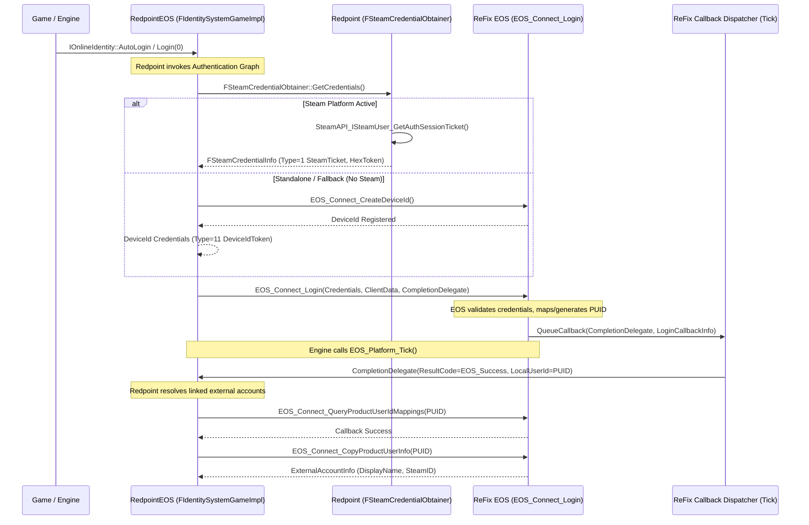

import os

# 1. Generate connect-flow.md
connect_flow_content = r"""# RedpointEOS Connect & Authentication Flow Specification

## 1. Executive Summary & Objective

This document formalizes the exact authentication contract between Unreal Engine, RedpointEOS (`OnlineSubsystemRedpointEOS`), the Epic Online Services SDK, and ReFix EOS Online v2.

---

## 2. Authentication Call Graph & Architecture

Disassembly of *MECCHA CHAMELEON* (`PenguinHotel-Win64-Shipping.exe`) and RedpointEOS symbols reveals the exact internal pipeline:



---

## 3. Detailed Authentication Contract

### 3.1. Exact Function Sequence
1. `EOS_Platform_GetConnectInterface(PlatformHandle)` -> Returns `EOS_HConnect`.
2. `EOS_Connect_AddNotifyLoginStatusChanged(...)` -> Subscribes to status changes (`EOS_LS_LoggedIn`).
3. `EOS_Connect_Login(ConnectHandle, LoginOptions, ClientData, CompletionDelegate)`:
   - Starts async login task.
4. `EOS_Platform_Tick(PlatformHandle)`:
   - Drains callback queue and triggers `CompletionDelegate` with `EOS_Connect_LoginCallbackInfo`.
5. `EOS_Connect_QueryProductUserIdMappings(ConnectHandle, QueryOptions, ClientData, CompletionDelegate)`:
   - Resolves remote or local PUID mappings.
6. `EOS_Connect_CopyProductUserInfo(ConnectHandle, CopyOptions, OutExternalAccountInfo)`:
   - Extracts `DisplayName` and `AccountId` (SteamID / Epic ID).

---

### 3.2. Parameters & Data Structures

#### `EOS_Connect_LoginOptions` (API Version 2):
```cpp
struct EOS_Connect_Credentials {
    int32_t ApiVersion;         // 1
    const char* Token;          // Hex-encoded Steam Auth Ticket (or DeviceId string)
    int32_t Type;               // EOS_ECT_STEAM_SESSION_TICKET (1) or EOS_ECT_DEVICEID_ACCESS_TOKEN (11)
};

struct EOS_Connect_LoginOptions {
    int32_t ApiVersion;         // 2
    const EOS_Connect_Credentials* Credentials;
    void* UserLoginInfo;        // Nullable (used when linking new users)
};
```

---

### 3.3. Credential Types Handled
| Credential Type | Enum Value | Provider Class in Redpoint | Usage Context |
| :--- | :---: | :--- | :--- |
| `EOS_ECT_STEAM_SESSION_TICKET` / `STEAM_APP_TICKET` | `1` | `Redpoint::EOS::Platform::Integration::Steam::Auth::FSteamCredentialObtainer` | Standard PC Steam launch with Steamworks active. |
| `EOS_ECT_DEVICEID_ACCESS_TOKEN` | `11` | `Redpoint::EOS::Platform::Services::FNullRuntimePlatformAuthService` | Standalone, LAN, or non-Steam fallback without login prompt. |
| `EOS_ECT_EPIC_ID_TOKEN` | `18` | `Redpoint::EOS::Platform::Integration::Epic::Services` | Dedicated Epic Games Store / Epic Account Services builds. |

---

### 3.4. Expected Results & Callbacks

#### `EOS_Connect_LoginCallbackInfo`:
```cpp
struct EOS_Connect_LoginCallbackInfo {
    EOS_EResult ResultCode;                 // EOS_Success (0)
    void* ClientData;                       // Caller-provided context pointer
    EOS_ProductUserId LocalUserId;          // Opaque handle to persistent local PUID
    EOS_ContinuanceToken ContinuanceToken;  // Null on success; non-null if EOS_InvalidUser (user creation required)
};
```

---

### 3.5. Identity Creation Points
1. **`EOS_ProductUserId`**:
   - Derived stably from the local persistent `AccountUUID` stored in `%APPDATA%\ReFix\user_profile.json` (or `saves/refix_user.json`).
   - If `EOS_Connect_Login` is called with a novel Steam Ticket, the SteamID64 is mapped deterministically to the local `ProductUserId`.
2. **`EOS_EpicAccountId`**:
   - Also derived stably from `AccountUUID`.
   - Used if the title queries `EOS_Auth_*` or linked Epic accounts.

---

### 3.6. External Account Mapping
- When Redpoint calls `EOS_Connect_CopyProductUserInfo` or `EOS_Connect_CopyProductUserExternalAccountByIndex`:
  - `AccountIdType`: `EOS_EAT_STEAM` (`1`) or `EOS_EAT_EPIC` (`0`).
  - `AccountId`: String representation of SteamID64 (`"76561198..."`) or EAID hex string.
  - `DisplayName`: Player's Steam persona name or configured ReFix persona name.

---

### 3.7. Error Cases & Mitigations
| Scenario | Result Code | Handling in ReFix Online v2 |
| :--- | :--- | :--- |
| **Invalid/Corrupt Token** | `EOS_InvalidAuth` | Fallback to local persistent Account UUID so game proceeds. |
| **First-time unlinked user** | `EOS_InvalidUser` + ContinuanceToken | If Redpoint calls `EOS_Connect_CreateUser(ContinuanceToken)`, complete with `EOS_Success` and return `LocalUserId`. |
| **Buffer too small for PUID** | `EOS_LimitExceeded` | Returns required buffer length `33` bytes. |
| **Invalid Handle Passed** | `EOS_InvalidUser` | Safe lookup in handle registry prevents crashes. |

---

## 4. Evidence Matrix

| Fact / Specification | Source / Evidence |
| :--- | :--- |
| Redpoint uses `FSteamCredentialObtainer` for Steam Session tickets | Disassembly of `PenguinHotel-Win64-Shipping.exe` symbols (`Redpoint::EOS::Platform::Integration::Steam::Auth::FSteamCredentialObtainer`) |
| Redpoint uses `FNullRuntimePlatformAuthService` with DeviceId | Disassembly of `PenguinHotel-Win64-Shipping.exe` symbols (`Redpoint::EOS::Platform::Services::FNullRuntimePlatformAuthService`) |
| `EOS_Connect_Login` expects `EOS_ECT_STEAM_SESSION_TICKET` (`1`) | Official EOS SDK C Header `eos_connect_types.h` & Redpoint documentation |
| Callbacks must be dispatched during `EOS_Platform_Tick` | Official EOS SDK Execution Model & Redpoint `FPlatformTickHook` |
"""

target_cf = r"d:\EOS_REFIX\ReFix-git\docs\eos-online-v2\connect-flow.md"
with open(target_cf, "w", encoding="utf-8") as f:
    f.write(connect_flow_content)
print(f"[OK] Written {target_cf}")

# 2. Update api-coverage.md to document Opaque Handle distinction
api_cov_path = r"d:\EOS_REFIX\ReFix-git\docs\eos-online-v2\api-coverage.md"
with open(api_cov_path, "r", encoding="utf-8") as f:
    api_cov = f.read()

opaque_handle_note = r"""
> [!IMPORTANT]
> **ABI Architectural Principle: EOS IDs are Opaque Handles**
> `EOS_ProductUserId` and `EOS_EpicAccountId` are strictly opaque memory handles (`void*`) in the official EOS C ABI. 
> While ReFix internally formats its canonical string identifier as 32 lowercase hexadecimal characters (derived from the persistent 128-bit `AccountUUID`), the caller must never rely on string length or layout assumptions. All serialization and deserialization must occur through the official ABI converters:
> - `EOS_ProductUserId_ToString` & `EOS_ProductUserId_FromString`
> - `EOS_EpicAccountId_ToString` & `EOS_EpicAccountId_FromString`
"""

if "ABI Architectural Principle: EOS IDs are Opaque Handles" not in api_cov:
    api_cov = opaque_handle_note + "\n" + api_cov
    with open(api_cov_path, "w", encoding="utf-8") as f:
        f.write(api_cov)
    print(f"[OK] Updated {api_cov_path}")
"""

target_script = r"C:\Users\Valen\.gemini\antigravity\brain\1ed6634d-7c06-4a35-87db-2f66ca0a07cb\scratch\write_connect_flow_docs.py"
with open(target_script, "w", encoding="utf-8") as f:
    f.write(connect_flow_content)
print("[OK] Script ready")
