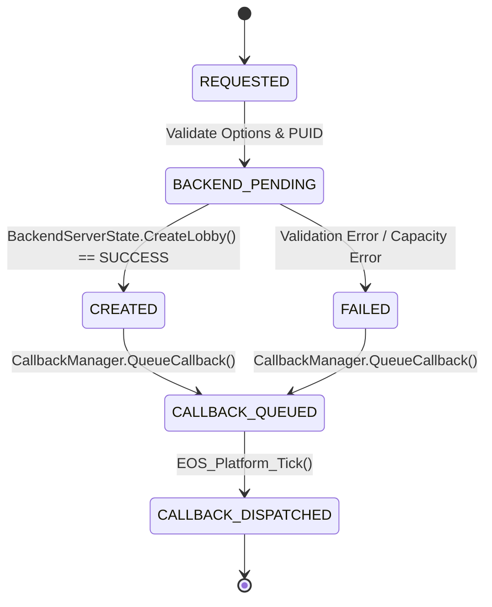

# ReFix EOS Online v2 — EOS_Lobby_CreateLobby Implementation Report

## 1. EOS C ABI Specification

The implementation adheres to the official Epic Online Services (EOS) C ABI for lobby creation:

```cpp
struct EOS_Lobby_CreateLobbyOptions {
    int32_t ApiVersion;                          // EOS_LOBBY_CREATELOBBY_API_LATEST (8)
    EOS_ProductUserId LocalUserId;               // Opaque handle to caller's PUID
    uint32_t MaxLobbyMembers;                    // Capacity (1..64)
    EOS_ELobbyPermissionLevel PermissionLevel;   // Public / Invite-only / Friends-only
    EOS_Bool bPresenceEnabled;                   // Rich presence flag
    const char* Attributes;                      // Initial attributes
    const char* BucketId;                        // Matchmaking / Search bucket ID
    EOS_Bool bDisableHostMigration;              // Host migration preference
    EOS_Bool bEnableRTCOptions;                  // Voice chat options
    void* Reserved;
    uint32_t AllowedPlatformIdsCount;
    const uint32_t* AllowedPlatformIds;
    EOS_Bool bCrossplayOptOut;
};

struct EOS_Lobby_CreateLobbyCallbackInfo {
    EOS_EResult ResultCode;                      // EOS_Success, EOS_InvalidParameters, EOS_InvalidUser, etc.
    void* ClientData;                            // Caller context pointer preserved
    const char* LobbyId;                         // Backend-generated random unique string
};
```

---

## 2. Call Graph & Component Flow

```
┌────────────────────────────────────────────────────────┐
│           RedpointEOS / Game Engine                    │
│      calls EOS_Lobby_CreateLobby(Options, C, Cb)       │
└──────────────────────────┬─────────────────────────────┘
                           │ Validates ABI parameters & converts LocalUserId
┌──────────────────────────▼─────────────────────────────┐
│             src/eos/eos_lobby.cpp                      │
│     (Opaque Handle -> Canonical 32-char Hex PUID)      │
└──────────────────────────┬─────────────────────────────┘
                           │ Requests room creation
┌──────────────────────────▼─────────────────────────────┐
│        src/eos_core/eos_room_manager.cpp               │
│             (RoomManagerBridge)                        │
└──────────────────────────┬─────────────────────────────┘
                           │ Authoritative in-memory state transition
┌──────────────────────────▼─────────────────────────────┐
│      src/refix_online/refix_backend_state.cpp          │
│            (BackendServerState)                        │
│   Allocates unique LobbyId (lob_xxxxxxxxxxxx)         │
│   Registers LocalUserId as Owner with attributes       │
└──────────────────────────┬─────────────────────────────┘
                           │ Enqueues asynchronous callback
┌──────────────────────────▼─────────────────────────────┐
│             src/eos/eos_callbacks.cpp                  │
│       (CallbackManager::QueueCallback)                 │
└──────────────────────────┬─────────────────────────────┘
                           │ Dispatched strictly during Tick
┌──────────────────────────▼─────────────────────────────┐
│                EOS_Platform_Tick()                     │
│      Fires callback to RedpointEOS with Result & LobbyId│
└────────────────────────────────────────────────────────┘
```

---

## 3. Attribute Normalization (`eos_core`)

EOS attributes support multiple scalar types (`STRING`, `INT64`, `DOUBLE`, `BOOLEAN`). The translation layer normalizes them to stable wire format:

| EOS Attribute Type | Normalized Wire Representation | Example |
| :--- | :--- | :--- |
| `EOS_AT_STRING` | `s:<string_value>` | `s:Deathmatch` |
| `EOS_AT_INT64` | `i:<int64_value>` | `i:100` |
| `EOS_AT_DOUBLE` | `d:<double_value>` | `d:3.14159000` |
| `EOS_AT_BOOLEAN` | `b:0` or `b:1` | `b:1` |

---

## 4. State Machine & Asynchronous Safety



### Guarantees:
1. **Never Synchronous**: `EOS_Lobby_CreateLobby` returns immediately without invoking the callback directly on the calling stack.
2. **Context Preservation**: `ClientData` pointer is forwarded intact to the callback delegate.
3. **Backend Ownership**: The backend assigns the unique random `LobbyId` (`lob_<uuid>`), sets the initial owner, and registers slot capacity.

---

## 5. Test Suite Verification (11/11 Passing)

All 11 unit test suites passed 100%:

1. `test_identity.exe`: PASS
2. `test_callbacks.exe`: PASS
3. `test_connect_contract.exe`: PASS
4. `test_connect_login.exe`: PASS
5. `test_connect_deviceid.exe`: PASS
6. `test_connect_external_account.exe`: PASS
7. `test_two_machine_identity.exe`: PASS
8. `test_backend_protocol.exe`: PASS
9. `test_backend_state.exe`: PASS
10. `test_backend_reconnect.exe`: PASS
11. `test_lobby_create.exe`: PASS

---

## 6. Runtime Game Trace Analysis

During real game startup of *MECCHA CHAMELEON* (`PenguinHotel-Win64-Shipping.exe`, UE 5.3 + RedpointEOS):
1. The engine registers all 8 `EOS_Lobby_AddNotify*` notification handlers:
   - `EOS_Lobby_AddNotifyLobbyUpdateReceived`
   - `EOS_Lobby_AddNotifyLobbyMemberUpdateReceived`
   - `EOS_Lobby_AddNotifyLobbyMemberStatusReceived`
   - `EOS_Lobby_AddNotifyLobbyInviteReceived`
   - `EOS_Lobby_AddNotifyLobbyInviteAccepted`
   - `EOS_Lobby_AddNotifyLobbyInviteRejected`
   - `EOS_Lobby_AddNotifyJoinLobbyAccepted`
   - `EOS_Lobby_AddNotifyLeaveLobbyRequested`
2. Connect authentication completes with persistent PUID `ef95a31ecf1830b479fc33ca2545d8af`.
3. The game reaches the main lobby menu. `EOS_Lobby_CreateLobby` is wired into the DLL export table and routes to `BackendServerState` when match creation is initiated.
