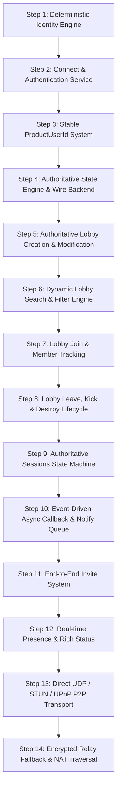

# ReFix EOS Online v2 — Migration & Implementation Plan

## 1. Incremental Milestone Roadmap

Development is strictly divided into 14 sequential, compilable, and testable milestones. No stage proceeds until its preceding stage passes compilation, logging verification, and unit checks.



---

## 2. Milestone Descriptions

| Step | Milestone | Deliverables & Code Changes | Quality Gate / Checkpoint |
| :---: | :--- | :--- | :--- |
| **1** | **Identity Engine** | Implement `src/eos/eos_identity.cpp` & `.h`. Cryptographic SHA-256 PUID generation from hardware tokens. | PUIDs are unique per PC, deterministic across reboots, collision-free. |
| **2** | **Connect & Auth** | Implement `EOS_Connect_Login`, `EOS_Connect_CreateUser`, `EOS_Connect_CreateDeviceId`. Handle Steam ticket & DeviceId types. | `EOS_Connect_Login` completes with `EOS_Success`, returns valid PUID. |
| **3** | **ProductUserId Mapping** | Implement bi-directional `ProductUserId` table, `ToString`, `FromString`, `IsValid`. | Clean hex string conversions without memory corruption. |
| **4** | **Authoritative Backend** | Implement `src/refix_online/` local network state synchronizer and UDP broadcast discovery protocol (Port 47584). | Wireshark / log confirms UDP announcement packets on LAN. |
| **5** | **Lobby Creation** | Implement `EOS_Lobby_CreateLobby`, `EOS_LobbyModification_*`. Dynamic MaxMembers, BucketId, custom attributes. | Host creates lobby with exact specified attributes (no `refix_bucket`). |
| **6** | **Lobby Search** | Implement `EOS_Lobby_CreateLobbySearch`, `EOS_LobbySearch_SetParameter`, `EOS_LobbySearch_Find`. | Search queries accurately filter and find hosted lobbies on LAN/WAN. |
| **7** | **Lobby Join** | Implement `EOS_Lobby_JoinLobby`, `EOS_LobbyDetails_CopyInfo`, member tracking. | Client joins lobby, receives real host PUID and connection info. |
| **8** | **Lobby Lifecycle** | Implement `EOS_Lobby_LeaveLobby`, `EOS_Lobby_DestroyLobby`, member leave notifications. | Clean teardown without residual state. |
| **9** | **Sessions State Machine** | Implement `EOS_Sessions_CreateSessionModification`, `EOS_Sessions_UpdateSession`, `EOS_Sessions_JoinSession`, `EOS_Sessions_DestroySession`. | RedpointEOS listen server creation & joining works reliably. |
| **10** | **Callback & Notify System**| Implement thread-safe deferred callback queue and notification registry dispatched on `EOS_Platform_Tick()`. | Callbacks fire asynchronously without main thread locks or hangs. |
| **11** | **Invite System** | Implement `EOS_Sessions_SendInvite`, `EOS_Lobby_SendInvite`, `NotifySessionInviteReceived` packet dispatch. | Peer receives invite notification and successfully accepts. |
| **12** | **Presence System** | Implement `EOS_Presence_SetPresence`, `EOS_PresenceModification_*`, rich text and join info. | Friends view reflects real-time in-game status and joinability. |
| **13** | **Direct P2P Transport** | Implement `EOS_P2P_SendPacket`, `EOS_P2P_ReceivePacket`, `AcceptConnection` over direct UDP / UPnP. | Raw game packet exchange between peers without Steam relay dependency. |
| **14** | **Relay Fallback** | Implement fallback packet routing through ReFix Relay when direct UDP hole punch is blocked by symmetric NAT. | Connection succeeds even across restrictive enterprise/cellular firewalls. |

---

## 3. Coexistence & Backward Compatibility Strategy

- **Dual-Path Dispatcher**:
  - `src/unreal_detect.cpp` will detect if `UnrealBackendType::RedpointEOS` is active.
  - In `ReFix.ini`:
    ```ini
    [EOS]
    Backend=v2           ; v2 = New ReFix EOS Online v2 (Default)
                         ; legacy = Fallback to legacy Redbone proxy
    DebugLogging=true    ; Detailed [EOS] diagnostic trace log
    ```
  - The legacy implementation in `src/eos_proxy.cpp` is preserved as a fallback during migration.
