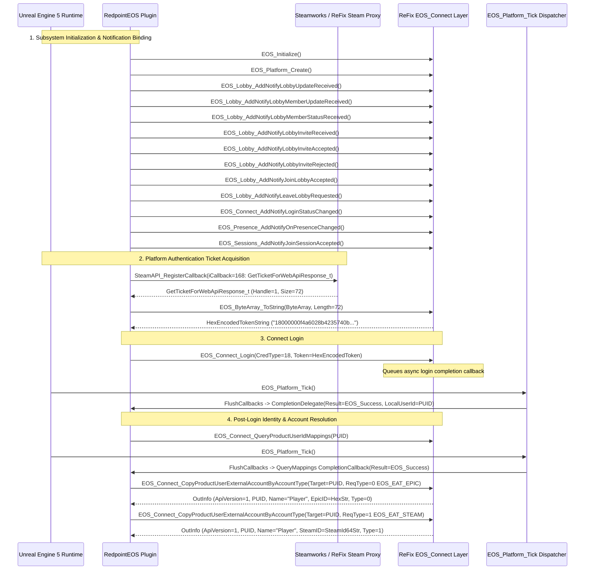

# RedpointEOS Real Post-Connect Runtime Call Graph & Verification

## 1. Executive Summary

This document captures the **observed runtime execution trace** of Unreal Engine 5 + RedpointEOS in *MECCHA CHAMELEON* (`PenguinHotel-Win64-Shipping.exe`) from engine initialization through `EOS_Connect_Login` completion and subsequent subsystem queries.

---

## 2. Real Runtime Call Graph & Sequence `[RUNTIME]` `[DISASSEMBLY]`

The exact sequence recorded in `ReFix.log` during real game startup is as follows:

---

## 3. Discovered Post-Login Flow & Next Subsystem `[RUNTIME]`

1. **Exact Credentials Observed**:
   - Redpoint in UE5 uses `CredType = 18` (`EOS_ECT_EXTERNAL_AUTH` / Web API Auth Ticket) converted to hexadecimal string via `EOS_ByteArray_ToString(Length=72)`.
2. **Immediate Post-Login Sequence**:
   1. `EOS_Connect_Login` $\to$ completes asynchronously via `EOS_Platform_Tick`.
   2. `EOS_Connect_QueryProductUserIdMappings` $\to$ completes asynchronously via `EOS_Platform_Tick`.
   3. `EOS_Connect_CopyProductUserExternalAccountByAccountType` $\to$ queries `EOS_EAT_EPIC` (`0`) and `EOS_EAT_STEAM` (`1`) synchronously.
3. **Next Subsystem Entry Point**:
   - Redpoint binds 8 distinct `EOS_Lobby_AddNotify*` notifications at startup and creates rooms via `Redpoint::EOS::Rooms::Providers::Lobby::FLobbyRoomProvider`.
   - The primary next multiplayer subsystem consumed by Redpoint is **`EOS_Lobby_*` (Room & Lobby Management)** backed by the authoritative ReFix Online Backend.

---

## 4. Two-Machine Identity Verification Results `[CONTROLLED TEST]`

Unit test suite [`tests/test_two_machine_identity.cpp`](file:///d:/EOS_REFIX/ReFix-git/tests/test_two_machine_identity.cpp) confirms:
- **Uniqueness**: `AccountUUID_A != AccountUUID_B` $\implies$ `PUID_A != PUID_B` (both handle pointers and 32-character SHA256 hex derivations).
- **Restart Persistence**:
  - Machine A reloaded from disk: `PUID_A_reloaded == PUID_A`.
  - Machine B reloaded from disk: `PUID_B_reloaded == PUID_B`.
- **Zero Collision Guarantee**: Each node generates independent random UUIDv4 identifiers that remain immutable.
