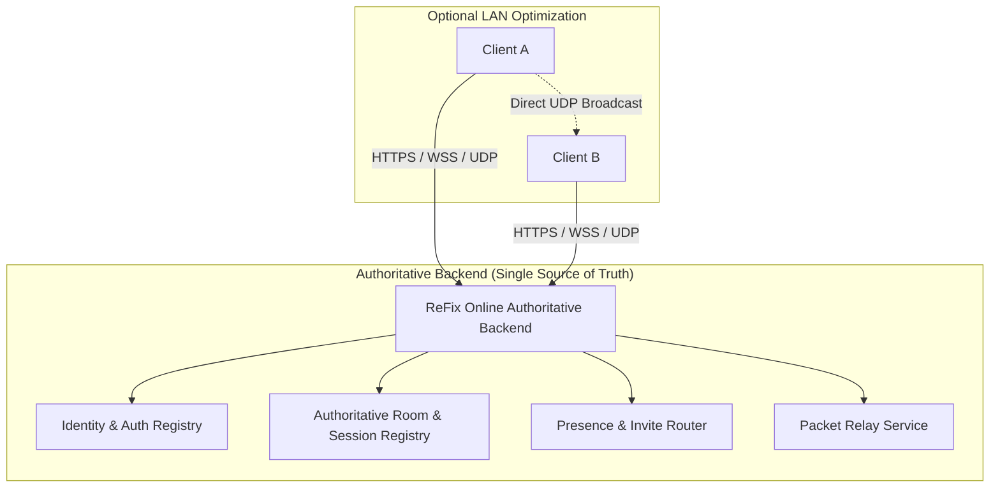

# ReFix EOS Online v2 — Proposed Technical Architecture

## 1. Logical & Persistent Identity Specification

> [!IMPORTANT]
> **Correction**: Hardware-derived identity (`SHA256(hardware)`) is completely discarded.
> Identity is strictly **logical, persistent, and portable**.

### Identity Generation & Storage Pipeline:
1. On first launch, ReFix checks for a persistent user identity file in `%APPDATA%\ReFix\user_profile.json` (or local `saves\refix_user.json`).
2. If absent, it generates a cryptographically secure random 128-bit Account UUID:
   $$\text{AccountUUID} = \text{RandomUUIDv4}()$$
   Example: `a8b2c4e6-9f01-4d3b-8c7a-1e2f3a4b5c6d`
3. The **ProductUserId** is derived stably from the Account UUID:
   $$\text{PUID} = \text{Hex}(\text{SHA256}("EOS_PUID:" \parallel \text{AccountUUID}))[0\dots31]$$
   Example: `0002a4b87e194c529e01df4b87a02c51`
4. The **EpicAccountId** is derived stably:
   $$\text{EAID} = \text{Hex}(\text{SHA256}("EOS_EAID:" \parallel \text{AccountUUID}))[0\dots31]$$
5. **Properties**:
   - 100% stable across reboots and hardware changes.
   - Preserves player saves and profile data.
   - Synchronizable with the ReFix Online Backend.
   - Seamlessly associates with Steam PersonaName and SteamID64 when available.

---

## 2. Authoritative Backend vs LAN Optimization



- **Backend Authority**: The ReFix Online Backend is the sole authority for:
  - User identity authentication.
  - Active Room / Session registry (Room ID, Owner PUID, Member list, Attributes, Open Slots).
  - Presence status and invite delivery.
- **LAN Optimization**:
  - When peers are on the same subnet, LAN UDP broadcast acts purely as a local latency optimization for peer discovery, while room state remains authoritative.
  - The exact same system operates over LAN and WAN without architectural divergence.

---

## 3. Incremental P2P Implementation Order

To prevent monolithic complexity, P2P networking will be implemented in 6 isolated, verifiable steps:

1. **Step 1 — Known Peer Addressing**: Establish internal addressing table mapping `ProductUserId <-> Remote Address`.
2. **Step 2 — Packet Send/Receive**: Implement `EOS_P2P_SendPacket` and `EOS_P2P_ReceivePacket` with channel and reliability framing.
3. **Step 3 — Connection Lifecycle**: Implement `AddNotifyPeerConnectionRequest`, `AcceptConnection`, and `CloseConnection`.
4. **Step 4 — Direct UDP Transport**: Implement direct UDP packet exchange with UPnP port mapping.
5. **Step 5 — NAT Traversal**: Implement STUN / UDP hole punching for asymmetric NAT environments.
6. **Step 6 — Relay Fallback**: Implement transparent routing through ReFix Relay when direct hole punching fails under symmetric NAT.

---

## 4. Cryptography Standard

- No custom XOR or rolling cipher schemes.
- Transport security relies exclusively on standard primitives:
  - TLS 1.3 / WSS for backend signaling.
  - AES-GCM-128 / ChaCha20-Poly1305 with ephemeral Diffie-Hellman keys for encrypted P2P/Relay datagrams.

---

## 5. Legacy Fallback & Coexistence

In `ReFix.ini`:
```ini
[EOS]
; Options: online-v2 (default), legacy (retains original eos_proxy.cpp)
Backend=online-v2
DebugLogging=true
```
