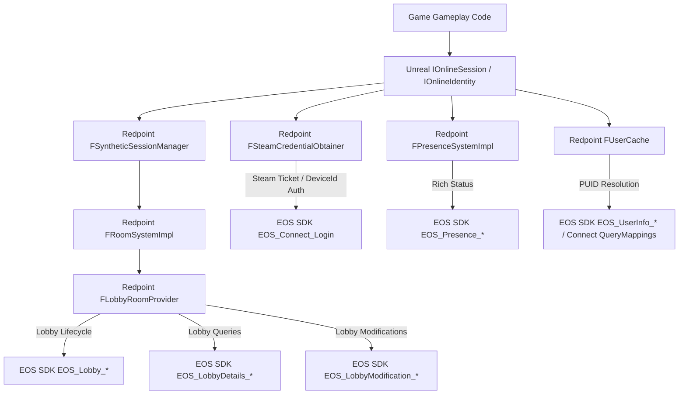

# RedpointEOS Runtime Call Graph & API Classification Map

## 1. Binary Symbol Extraction Evidence

Analysis of the test game executable *MECCHA CHAMELEON* (`PenguinHotel-Win64-Shipping.exe`, UE5 + RedpointEOS) reveals the exact internal class hierarchy used by Redpoint:

```
Redpoint::EOS::Platform::Integration::Steam::Auth::FSteamCredentialObtainer
Redpoint::EOS::Rooms::FRoomSystemImpl
Redpoint::EOS::Rooms::Providers::Lobby::FLobbyRoomProvider
Redpoint::EOS::Rooms::Providers::Lobby::FLobbyRoomProviderReadOperation
Redpoint::EOS::Rooms::Providers::Lobby::FLobbyRoomProviderSearchOperation
Redpoint::EOS::Rooms::Providers::Lobby::FLobbyRoomProviderUpdateOperation
Redpoint::EOS::Presence::FPresenceSystemImpl
Redpoint::EOS::UserCache::FUserCache
Redpoint::EOS::OnlineSubsystemRedpointEOS::Legacy::FSyntheticSessionManager
```

This confirms the exact architectural pipeline:


---

## 2. API Classification by Lifecycle Stage

### Stage 1: Initialization & Platform Setup
| Function | Redpoint Caller Class | Classification | Required? |
| :--- | :--- | :--- | :--- |
| `EOS_Initialize` | `FPlatformInitialization` | Called at runtime | **Required** |
| `EOS_Platform_Create` | `FPlatformInitialization` | Called at runtime | **Required** |
| `EOS_Platform_GetConnectInterface` | `FPlatformInitialization` | Called at runtime | **Required** |
| `EOS_Platform_GetLobbyInterface` | `FPlatformInitialization` | Called at runtime | **Required** |
| `EOS_Platform_GetSessionsInterface` | `FPlatformInitialization` | Called at runtime | **Required** |
| `EOS_Platform_GetP2PInterface` | `FPlatformInitialization` | Called at runtime | **Required** |
| `EOS_Platform_GetPresenceInterface` | `FPlatformInitialization` | Called at runtime | **Required** |
| `EOS_Platform_GetFriendsInterface` | `FPlatformInitialization` | Called at runtime | **Required** |
| `EOS_Platform_GetUserInfoInterface` | `FPlatformInitialization` | Called at runtime | **Required** |
| `EOS_Platform_GetPlayerDataStorageInterface` | `FPlatformInitialization` | Called at runtime | Optional |
| `EOS_Platform_Tick` | `FPlatformTickHook` | Called during engine tick | **Required** |
| `EOS_Platform_Release` | `FPlatformShutdown` | Called during engine shutdown | **Required** |
| `EOS_Shutdown` | `FPlatformShutdown` | Called during engine shutdown | **Required** |

### Stage 2: Authentication & Identity
| Function | Redpoint Caller Class | Classification | Required? |
| :--- | :--- | :--- | :--- |
| `EOS_Connect_Login` | `FSteamCredentialObtainer` | Called during login | **Required** |
| `EOS_Connect_CreateUser` | `FSteamCredentialObtainer` | Called on first login | **Required** |
| `EOS_Connect_CreateDeviceId` | `FDeviceIdCredentialObtainer` | Called if Steam absent | Optional |
| `EOS_Connect_AddNotifyLoginStatusChanged` | `FAuthHandler` | Called during login setup | **Required** |
| `EOS_Connect_QueryProductUserIdMappings` | `FUserCache` | Called during user sync | **Required** |
| `EOS_Connect_GetProductUserIdMapping` | `FUserCache` | Called during user sync | **Required** |
| `EOS_Connect_CopyProductUserInfo` | `FUserCache` | Called during user sync | **Required** |
| `EOS_Connect_CopyProductUserExternalAccountByIndex` | `FUserCache` | Called during user sync | **Required** |
| `EOS_Connect_ExternalAccountInfo_Release` | `FUserCache` | Called during user sync | **Required** |
| `EOS_ProductUserId_IsValid` | Core EOS utility | Called throughout runtime | **Required** |
| `EOS_ProductUserId_ToString` | Core EOS utility | Called throughout runtime | **Required** |
| `EOS_ProductUserId_FromString` | Core EOS utility | Called throughout runtime | **Required** |

### Stage 3: Matchmaking & Room Management (Lobbies via `FLobbyRoomProvider`)
| Function | Redpoint Caller Class | Classification | Required? |
| :--- | :--- | :--- | :--- |
| `EOS_Lobby_CreateLobby` | `FLobbyRoomProvider::ExecuteCreateRoomOperation` | Called during Host | **Required** |
| `EOS_Lobby_CreateLobbyModification` | `FLobbyRoomProviderUpdateOperation` | Called during Host/Update | **Required** |
| `EOS_LobbyModification_SetMaxMembers` | `FLobbyRoomProviderUpdateOperation` | Called during Host/Update | **Required** |
| `EOS_LobbyModification_SetPermissionLevel` | `FLobbyRoomProviderUpdateOperation` | Called during Host/Update | **Required** |
| `EOS_LobbyModification_SetBucketId` | `FLobbyRoomProviderUpdateOperation` | Called during Host/Update | **Required** |
| `EOS_LobbyModification_SetInvitesAllowed` | `FLobbyRoomProviderUpdateOperation` | Called during Host/Update | **Required** |
| `EOS_LobbyModification_AddAttribute` | `FLobbyRoomProviderUpdateOperation` | Called during Host/Update | **Required** |
| `EOS_LobbyModification_Release` | `FLobbyRoomProviderUpdateOperation` | Called during Host/Update | **Required** |
| `EOS_Lobby_UpdateLobby` | `FLobbyRoomProvider::ExecuteUpdateRoomOperation` | Called during Host/Update | **Required** |
| `EOS_Lobby_CreateLobbySearch` | `FLobbyRoomProviderSearchOperation` | Called during Find | **Required** |
| `EOS_LobbySearch_SetParameter` | `FLobbyRoomProviderSearchOperation` | Called during Find | **Required** |
| `EOS_LobbySearch_Find` | `FLobbyRoomProvider::ExecuteSearchRoomsOperationWithTimeout` | Called during Find | **Required** |
| `EOS_LobbySearch_GetSearchResultCount` | `FLobbyRoomProviderSearchOperation` | Called during Find | **Required** |
| `EOS_LobbySearch_CopySearchResultByIndex` | `FLobbyRoomProviderSearchOperation` | Called during Find | **Required** |
| `EOS_LobbySearch_Release` | `FLobbyRoomProviderSearchOperation` | Called during Find | **Required** |
| `EOS_LobbyDetails_CopyInfo` | `FLobbyRoomProviderReadOperation::GetInfo` | Called during Find/Join | **Required** |
| `EOS_LobbyDetails_GetAttributeCount` | `FLobbyRoomProviderReadOperation::GetAttributes` | Called during Find/Join | **Required** |
| `EOS_LobbyDetails_CopyAttributeByIndex` | `FLobbyRoomProviderReadOperation::GetAttributes` | Called during Find/Join | **Required** |
| `EOS_LobbyDetails_GetMemberCount` | `FLobbyRoomProviderReadOperation::GetMembers` | Called during Find/Join | **Required** |
| `EOS_LobbyDetails_GetMemberByIndex` | `FLobbyRoomProviderReadOperation::GetMembers` | Called during Find/Join | **Required** |
| `EOS_LobbyDetails_Info_Release` | `FLobbyRoomProviderReadOperation` | Called during Find/Join | **Required** |
| `EOS_LobbyDetails_Release` | `FLobbyRoomProviderReadOperation` | Called during Find/Join | **Required** |
| `EOS_Lobby_JoinLobby` | `FLobbyRoomProvider::ExecuteJoinRoomOperation` | Called during Join | **Required** |
| `EOS_Lobby_LeaveLobby` | `FLobbyRoomProvider::ExecuteLeaveRoomOperation` | Called during Leave | **Required** |
| `EOS_Lobby_DestroyLobby` | `FLobbyRoomProvider::ExecuteLeaveRoomOperation` | Called during Destroy | **Required** |
| `EOS_Lobby_AddNotifyLobbyMemberStatusReceived`| `FLobbyRoomProvider` | Called during Join/Host | **Required** |
| `EOS_Lobby_AddNotifyLobbyUpdateReceived` | `FLobbyRoomProvider` | Called during Join/Host | **Required** |

### Stage 4: Invitations & Social
| Function | Redpoint Caller Class | Classification | Required? |
| :--- | :--- | :--- | :--- |
| `EOS_Lobby_SendInvite` | `FLobbyRoomProvider::ExecuteSendRoomInviteOperation` | Called during Invite | **Required** |
| `EOS_Lobby_AddNotifyLobbyInviteReceived` | `FLobbyRoomProvider` | Called during Init | **Required** |
| `EOS_Lobby_AddNotifyLobbyInviteAccepted` | `FLobbyRoomProvider` | Called during Init | **Required** |
| `EOS_Lobby_RejectInvite` | `FLobbyRoomProvider::RejectRoomInvite` | Called on Reject | Optional |
| `EOS_Presence_SetPresence` | `FPresenceSystemImpl::SetPresence` | Called on State Change | **Required** |
| `EOS_PresenceModification_*` | `FPresenceSystemImpl` | Called on State Change | **Required** |
| `EOS_Friends_QueryFriends` | `FOnlineFriendsEOS` | Called during Friends view | Optional |
| `EOS_Friends_GetFriendsCount` | `FOnlineFriendsEOS` | Called during Friends view | Optional |
| `EOS_Friends_GetFriendAtIndex` | `FOnlineFriendsEOS` | Called during Friends view | Optional |

### Stage 5: Sessions Subsystem (Dedicated / Listen Server Fallback)
| Function | Redpoint Caller Class | Classification | Required? |
| :--- | :--- | :--- | :--- |
| `EOS_Sessions_CreateSessionModification` | `FSyntheticSessionManager` | Called during Session Create | **Required** |
| `EOS_SessionModification_SetHostAddress` | `FSyntheticSessionManager` | Called during Session Create | **Required** |
| `EOS_SessionModification_SetMaxPlayers` | `FSyntheticSessionManager` | Called during Session Create | **Required** |
| `EOS_Sessions_UpdateSession` | `FSyntheticSessionManager` | Called during Session Create | **Required** |
| `EOS_Sessions_CreateSessionSearch` | `FSyntheticSessionManager` | Called during Session Search | **Required** |
| `EOS_SessionSearch_Find` | `FSyntheticSessionManager` | Called during Session Search | **Required** |
| `EOS_SessionDetails_CopyInfo` | `FSyntheticSessionManager` | Called during Session Search | **Required** |
| `EOS_Sessions_JoinSession` | `FSyntheticSessionManager` | Called during Session Join | **Required** |
| `EOS_Sessions_DestroySession` | `FSyntheticSessionManager` | Called during Session Destroy | **Required** |
| `EOS_Sessions_AddNotifySessionInviteReceived` | `FSyntheticSessionManager` | Called during Session Init | **Required** |

### Stage 6: Unused / Safety Stubs (Imported but non-critical for Matchmaking)
- `EOS_AntiCheatClient_*` & `EOS_AntiCheatServer_*` (27 APIs): Safety stubs returning `EOS_Success`.
- `EOS_RTC_*` & `EOS_RTCAudio_*` (21 APIs): Voice chat stubs returning `EOS_Success`.
- `EOS_Achievements_*`, `EOS_Leaderboards_*`, `EOS_Stats_*` (24 APIs): Secondary features.
- `EOS_Ecom_*` (16 APIs): Storefront / DLC query stubs.
