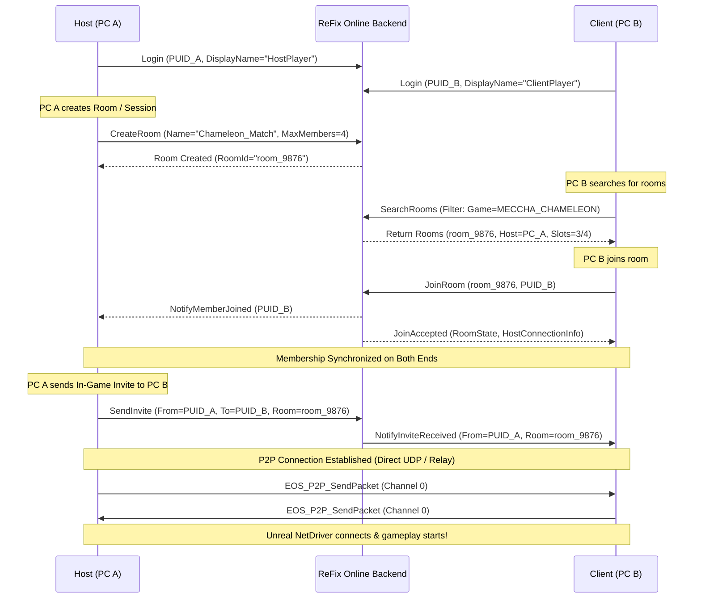

# ReFix EOS Online v2 — Test Plan & Golden Test Specification

## 1. The Golden Test (End-to-End Success Benchmark)

The ultimate verification standard for ReFix EOS Online v2:

---

## 2. Test Matrix Overview

| Test ID | Test Title | Scope | Expected Outcome |
| :--- | :--- | :--- | :--- |
| **Test A** | LAN Discovery & Matchmaking | 2 PCs on same LAN subnet | PC B discovers PC A's lobby/session with exact name, attributes, and slot count. |
| **Test B** | WAN Internet Matchmaking | 2 PCs on different networks | PC B discovers PC A over WAN signaling; establishes P2P connection via hole punch / relay. |
| **Test C** | End-to-End Invite Flow | 2 PCs (Host & Client) | Host sends invite -> Client receives `NotifyInviteReceived` -> Client accepts -> Auto-joins session. |
| **Test D** | Session Creation & Destroy Lifecycle | 1 PC (Repeated Create/Destroy) | Create Session A -> Destroy -> Create Session A again -> `EOS_Success` (No `AlreadyExists`). |
| **Test E** | Concurrent Multi-Session Hosting | 2 Host PCs | Host A creates Session A; Host B creates Session B -> Both coexist and are searchable independently. |
| **Test F** | Member Capacity & Boundary Rejection | 1 Host, N Clients | Create 4-player lobby -> Connect Clients 1, 2, 3 -> Client 4 receives `EOS_Lobby_TooManyPlayers` / rejected. |
| **Test G** | Metadata & Attribute Fidelity | Host & Client | Custom keys, map name, game mode, and server ports match exactly on search results without fake defaults. |
| **Test H** | Direct P2P & Relay Fallback | 2 PCs under Strict NAT | Direct UDP fails -> Seamlessly transitions to ReFix Relay -> Packets delivered with <100ms latency. |
| **Test I** | Non-EOS Subsystems Non-Regression | All game engine modes | Verify Re:Goldberg, Steamworks proxy, Godot proxy, and Re:Photon remain 100% operational. |
