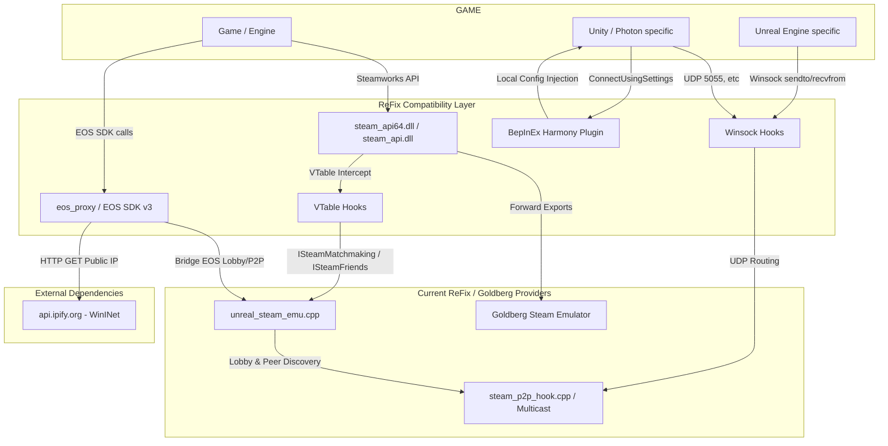

# ReFix LAN / Re:Goldberg — Architecture & Call Graph

## Current Implementation Map (Phase 1 Baseline)

## Summary of Findings (Phase 1 Audit)
- **Implemented:**
  - Steamworks ABI (x86/x64) via flat exports forwarding to Goldberg.
  - VTable hooking for crucial matchmaking/friends interfaces.
  - Winsock proxy for routing Unreal/Photon UDP traffic to Steam P2P.
  - EOS Lobby to Steam Matchmaking bridge.
- **Forwarded:**
  - Most Steam API flat exports are forwarded natively to the underlying Goldberg installation (`steam_api64_valve.dll`).
- **Hooked:**
  - `ISteamMatchmaking`, `ISteamMatchmakingServers`, `ISteamFriends`, `ISteamUGC`.
  - Winsock socket creation, `sendto`, `recvfrom`.
  - Unity Photon Realtime/Fusion endpoints via BepInEx.
- **Depends on Goldberg:**
  - Deep Steam profile management, stats, achievements, initial DLL loading.
- **Depends on Internet:**
  - `api.ipify.org` for Public IP (via EOS Proxy). 
  - Some SDR (Steam Datagram Relay) stubs exist but traffic is dropped or routed locally.
- **Depends on Steam Client:**
  - The offline mode generates an identity from `MachineGuid` and doesn't require a Steam installation.
